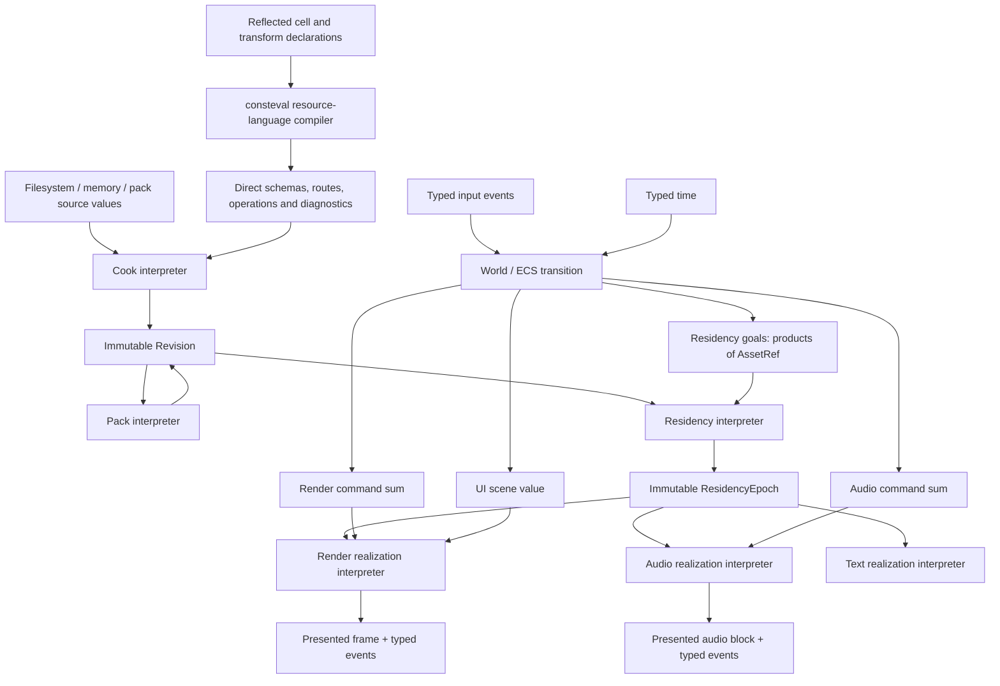

# Reflection-Compiled Residency Graph

## Introduction

### What a game-engine resource manager is

A game does not execute authoring files directly. Models, images, fonts, audio,
shaders, scenes, and other source assets must be interpreted, validated,
converted into engine-defined representations, packaged, loaded, realized by
the responsible device module, and eventually retired. The same logical asset
often has several representations: glTF source data, canonical mesh artifacts,
packed bytes, CPU views, and renderer-owned GPU buffers can all describe one
mesh at different points in its lifetime. Every one of those representations is
an addressable resource cell. The game-facing representation is conventional,
not privileged: gameplay code may hold a typed reference to source bytes,
decoded pixels, PCM samples, a canonical mesh, or a device-ready representation
when that is the representation it actually needs.

A resource manager is the engine subsystem that preserves the identity and
dependency relationships of those logical assets while moving their typed
representations through the offline and runtime pipeline.

| Term | Meaning |
|---|---|
| Source asset | Authoring input such as glTF/GLB, PNG/JPEG, OpenType, WAV, GLSL, an include file, or SPIR-V |
| Resource cell | Any typed, independently addressable value in a resource route, including source bytes, parsed source structure, canonical data, cooked data, runtime-loadable data, and owner realization |
| Artifact | A canonical typed resource cell produced by import, migration, cooking, or transformation |
| Top-level asset | The editor- and game-facing cell conventionally used to enter a resource graph; it has no exclusive addressing privilege over cells below it |
| Focused handle | A pointer-free `AssetRef<T>` naming a cell of reflected type `T` and, when derived by navigation, retaining the compact route context needed to return upward |
| Provenance | The selected producing transform and its typed input handles, represented as a reflected sum of products |
| Resident representation | A CPU view or an opaque renderer-, audio-, or text-owned slot ready for runtime use |
| Residency goal | A request for an addressable cell at a quality and priority required by the current world |
| Residency epoch | An immutable publication mapping stable cell identities to one mutually consistent generation of values and resident bindings |

The resource manager therefore spans two connected domains:

- Offline content processing imports source formats, validates and migrates
  typed data, incrementally cooks dependency graphs, stores exact products by
  content identity, and produces manifests and shipping packs.
- Runtime residency accepts demand from ECS and behavioral systems, reads and
  transforms artifacts, asks owner modules to realize device objects, publishes
  immutable bindings, and retires replaced or unneeded representations safely.

It is not merely a file cache or asynchronous loader. A complete resource
manager also answers which transformations are legal, which dependencies form
an atomic floor, which representation satisfies a platform, when a replacement
generation may become visible, and when the previous generation is safe to
destroy. It preserves stable typed references while content, packaging, memory
location, device objects, and quality levels change.

The resource manager does not absorb every subsystem that touches an asset.
ECS owns mutable simulation state. The renderer owns Vulkan objects. The audio
module owns mixer and device objects. The text module owns font realization.
The resource manager owns identity, typed transformation, demand reconciliation,
publication, and retirement across those boundaries.

### Existing solutions

Existing engines solve substantial parts of this problem with different centers
of gravity. The following systems are representative rather than exhaustive.

| System | Architectural center | Established strengths | Boundary changed by RCRG |
|---|---|---|---|
| [Unreal Asset Manager](https://dev.epicgames.com/documentation/en-us/unreal-engine/asset-management-in-unreal-engine) and [Asset Registry](https://dev.epicgames.com/documentation/en-us/unreal-engine/asset-registry-in-unreal-engine) | A global Asset Manager, asynchronously populated Asset Registry, primary and secondary asset IDs, bundles, configuration, and streamable handles around the `UObject` ecosystem | Mature discovery, cooking, chunking, auditing, asynchronous loading, and project customization | RCRG makes reflected artifact and transform declarations, rather than a global object plus configuration and registration, the structural authority for every pipeline stage. |
| [Unity Addressables](https://docs.unity3d.com/Packages/com.unity.addressables@1.21/manual/index.html) | Addresses and labels resolve through content catalogs to dependency-aware AssetBundles and asynchronous operation handles | Local or remote delivery, catalog updates, grouping, bundle construction, dependency download, and runtime loading | RCRG's manifest locates content, but its reflected type graph additionally compiles import, validation, migration, representation routes, owner realization, and ECS demand. |
| [Godot Resources](https://docs.godotengine.org/en/stable/tutorials/scripting/resources.html) and [import pipeline](https://docs.godotengine.org/en/stable/tutorials/assets_pipeline/import_process.html) | Path-addressed, cached, reference-counted `Resource` objects with engine serialization and editor-managed source import | Tight editor integration, shared loaded objects, automatic serialization, custom resource types, and straightforward scene composition | RCRG separates stable semantic identity from paths and object lifetime, then publishes immutable cross-module residency epochs instead of exposing one mutable cached object generation. |
| [Bevy Assets](https://docs.rs/bevy/latest/bevy/asset/) | `AssetServer`, registered asset types and loaders, strongly typed `Assets<T>` collections, and `Handle<T>` references integrated with ECS | Typed handles, asynchronous loading, dependency tracking, asset events, and development hot reload | RCRG preserves the typed ECS reference but compiles the asset inventory and legal transformations from declarations; demand, liveness, replacement, and owner bindings resolve through immutable epochs rather than handle-owned residency. |
| [O3DE Asset Pipeline](https://docs.o3de.org/docs/user-guide/assets/pipeline/) | Asset Processor, registered Asset Builders, processing jobs, source and product assets, an Asset Cache, database, catalog, and runtime asset system | End-to-end source processing, platform products, dependency tracking, incremental jobs, caching, catalogs, and hot-reload notifications | RCRG unifies the builder, product schema, runtime representation, ECS reference, and owner route in one reflected language instead of coordinating separate builder descriptors, products, catalogs, and runtime registrations. |

These systems demonstrate that typed handles, asynchronous loading, import
pipelines, dependency catalogs, incremental products, packaging, and hot reload
are proven requirements. RCRG adopts those requirements. Its departure is where
the system's structural truth lives and when inconsistencies are rejected.

### Anoptic's reflection-compiled approach

RCRG treats the complete resource domain as a language embedded in ordinary
C++. Public module interfaces declare artifact types, transformation functions,
`AssetRef<T>` fields, and typed annotations. A resource-universe translation
unit reflects those declarations and closes one type graph spanning source
import, cooking, validation, migration, packing, loading, device realization,
ECS demand, residency, reload, and retirement.

C++26 reflection makes the declarations themselves available as compile-time
values. Typed annotations add semantic facts without creating a stringly typed
side channel. A mandatory `consteval` compiler invokes ordinary `constexpr`
algorithms over the reflected graph to compute schemas, fingerprints,
dependencies, migration closure, legal representation routes, capability
matrices, executor ownership, and retained dispatch. Expansion statements and
splicing then emit direct member operations, exact types, and direct transform
calls. Only final immutable tables and diagnostics remain when runtime needs
them.

This produces one structural authority instead of a stack of synchronized
descriptions:

```text
public C++ declarations + typed annotations
                    |
                    v
      reflected compile-time type graph
                    |
       +------------+-------------+
       |            |             |
       v            v             v
 offline typed   runtime typed   ECS demand
 operations      routes/bindings extractors
       |            |             |
       +------------+-------------+
                    |
                    v
       direct ordinary generated C++
```

Within the one-language, no-parallel-IDL, no-external-generator contract, this
combination is enabled specifically by C++26 reflection and generation. A field
or transform is declared once and all affected importers, validators, encoders,
migrations, dependency extractors, routes, owner bridges, and ECS demand
extractors follow from it. Missing coverage is a compile error at the responsible
declaration rather than a runtime fallback or a human synchronization task.

Reflection does not replace algorithms with metadata. Reflection supplies
program structure; ordinary `constexpr` C++ performs parsing, hashing, graph,
validation, decoding, and transformation work; `consteval` requires language
closure during translation; expansion and splicing reify the result as direct
code. Templates parameterize inherently typed interfaces but own no parallel
metaprogram. Runtime still performs instance-dependent I/O, allocation,
scheduling, and owner-device effects, using signatures and routes already
compiled from the reflected language.

The result is a resource manager whose offline and runtime halves share one
typed definition of every resource, whose hot paths contain no reflection
interpreter, and whose unsupported structural combinations cannot enter a
successful build.

The closed declaration universe is normalized once. Each module consumes only
the projection relevant to its own compiler:

```text
D --reify--> W
W --rho_M--> W_M --C_M--> CompileError_M + Plan_M
```

`W` is a compile-time structural witness, not a runtime schema registry.
`rho_M` prevents a module compiler from inspecting unrelated declarations.
`C_M` is partial because malformed or incomplete declarations are rejected by
the `consteval` boundary. The resource universe is one projection of this
engine-wide witness; memory layouts, command protocols, foreign schemas, and
other reflected domains consume their own projections without becoming
resource cells.

### Addressable cells and composed routes

RCRG has no single semantic layer. Each layer has the semantics appropriate to
its consumer: a designer manipulates a room, an importer manipulates a glTF
scene, a texture transform manipulates pixels, and a renderer manipulates an
opaque GPU slot. All are cells in the same reflected graph and all are
addressable through `AssetRef<T>`.

A representative texture route is:

```text
AssetRef<Texture>                         editor/game-facing focus
        |
        v down()
AssetRef<RuntimeTexture>                  runtime-loadable focus
        |
        v down()
AssetRef<PixelImage>                      canonical pixel focus
        |
        v down(): selected provenance
  +-----+----------------+----------------+
  | ViaPng               | ViaJpeg        | ViaKtx2
  v                      v                v
AssetRef<PngFile>   AssetRef<JpegFile>   AssetRef<Ktx2File>
  |                      |                |
  +----------------------+----------------+
                         v
                  AssetRef<RawFile>
```

The branches under `PixelImage` are alternatives, not three values that must
all exist. The cooked instance records which producer was selected. A model or
scene may instead decompose into several required inputs or repeated members;
the same reflected rule preserves that product or collection shape.

For a cell `X` in one route:

```text
raw source --p--> X --q--> top-level asset
```

the complete computation is `q . p`. An `AssetRef<X>` is a typed focus at that
factorization point. It is not an object pointer and does not contain a closure.
`down()` moves the focus toward the actual inputs and provenance; `up()` moves
the focus toward the particular result from which it was derived. Navigation
returns handles and does not itself parse, load, realize, or copy a value.

Primitive transform signatures determine the exact algebraic result of
`down()`. If either `f` or `g` can produce `H`, while `k` requires two inputs:

```haskell
f :: A -> H
g :: B -> H
k :: (A, B) -> H

data HProvenance
  = ViaF (Ref A)
  | ViaG (Ref B)
  | ViaK (Ref A) (Ref B)
```

then the generated provenance for `H` is that closed sum of products. Producer
alternatives form the sum. One producer's required inputs form the product, and
one invocation's addressable results form its output-port product.
Optional and repeated inputs retain their optional and collection cardinality.
The cooker stores the selected constructor as a compact transform/output-port
ordinal plus its input cell identities; no runtime type erasure is introduced.

Every handle returned by `down()` retains a compact route witness back to the
specific result that produced it, like a typed zipper context. Its ordinary
`up()` is therefore singular. Enumerating every consumer of a globally shared
cell is a separate reverse-dependency query and may return several handles.
Likewise, a standalone lower-level handle with no selected top-level context
chooses an upward route explicitly when more than one route is legal.

The reflected declarations generate a typed many-to-many route language: cell
types are objects, transform functions are primitive routes, and legal routes
compose. Products express jointly required inputs and jointly produced outputs,
sums express alternative producer/output ports, and collections express
repeated cells. The compile-time program interprets that language as packed
runtime data:

| Reflected program | Packed runtime image |
|---|---|
| Cell type | Dense typed column and compile-time type ordinal |
| Cell instance | Compact stable identity and column index |
| Transform | Direct generated call |
| Composed route | Compiled materialization plan |
| Producer alternatives | Small generated transform/output-port tag |
| Required or repeated inputs | Packed tuple or span of typed identities |
| `up()` context | Compact route witness |
| Forward consequences | Compile-time reachability mask plus packed instance edges |
| Published graph version | Structurally shared immutable epoch |

Runtime therefore pays for array indexing, compact tags, and direct calls. It
does not chase virtual pointers, interpret a runtime object hierarchy, or walk
reflection metadata. Addressability does not require permanent materialization:
a cell may be absent until demanded, provided the active build profile retains
the cell or a legal route capable of materializing it.

## API algebra and whole-engine composition

RCRG treats an API as a type, not as a bag of functions. This is a design
method and a compile-time construction technique; it does not introduce a
runtime category framework, monad library, object hierarchy, or type-erased
dispatcher.

### Interfaces as polynomial types

For an interface `A`, let `Q_A` be its set of fully valued requests and let
`R_A(q)` be the response type belonging to request `q`. Its interaction shape
is the dependent polynomial

```text
P_A(X) = sum(q : Q_A) X ^ R_A(q)
```

An operation name and its arguments together form one `q`; the response family
may therefore depend on the selected operation and its values. In C++ terms:

| Algebra | C++26 declaration |
|---|---|
| `1` | Unit or a successful operation with no payload |
| `0` | An uninhabited or compile-rejected case |
| `A x B` | A record whose values are jointly required |
| `A + B` | A tagged alternative in which exactly one value exists |
| `1 + A` | An optional value |
| `A + E` | A successful value or a domain error |
| `List(A)` | A bounded span or owned finite sequence |
| `Ref(T)` | A stable identity indexed by the cell type `T` |

An adaptor from interface `A` to interface `B` consists of a forward request
map and a backward response map:

```text
request : Q_A -> Q_B
response_q : R_B(request(q)) -> R_A(q)
```

The opposite response direction is what lets a caller of `A` use the shape of
`B`. These adaptors compose. Interface sums express a choice of protocol and
interface products express independently available protocols. A shape adaptor
alone does not interpret either interface.

The unit polynomial is terminal for these adaptors: `Hom(A, 1)` is unique.
`Hom(1, A)` instead selects a global operation with no response positions and
is neither generally inhabited nor unique. The zero polynomial has no possible
request. Empty source files and absent modules do not establish either object.

API shape, semantic algebra, interpreter, and physical representation are four
different planes. For carrier `X_M` and effect functor `F_M`, meaning is supplied
by an algebra

```text
alpha_M : P_M(X_M) -> F_M(X_M)
```

An `API.Hom A B` induces only a natural translation between `P_A` and `P_B`.
It becomes an algebra homomorphism only with a carrier map `f`, a natural effect
map `eta : F_A => F_B`, and the commuting law

```text
F_B(f)(eta(alpha_A(p))) = alpha_B(P_h(f)(p))
```

where `P_h(f)` translates the request through both the API adaptor and carrier
map. Therefore a shape adaptor can exist while no corresponding semantic
homomorphism exists. The Lean model contains a concrete counterexample.

`F_M` is the concrete domain in which the owner is allowed to act:
filesystem I/O, worker execution, render-master device work, audio-block work,
or another explicit effect. Pure functions use the identity effect. Platform
backends are alternate interpreters of the same request and response families,
not alternate public APIs.

C++26 reflection reads records, enumerators, functions, parameters, return
types, and typed annotations as compile-time values. Ordinary `constexpr`
functions perform the algebra, a `consteval` boundary requires closure, and
expansion plus splicing emits the direct tagged sums, products, field accesses,
and calls. The mathematical representation and the packed runtime
representation are therefore homomorphic without retaining the mathematics as
runtime machinery.

### Governing composition model

Anoptic does not have one grand category in which every kind of composition is
the same operation. Its modules participate in several structures joined by
typed maps and refinement witnesses:

| Structure | Objects and maps | Composition used |
|---|---|---|
| API containers | Request families, response families, and adaptors | Forward request maps and backward response maps |
| Structural compilation | Reflected witness projections and partial plan compilers | Function composition, independent products, pullbacks, and refined dependent products |
| Resource routes | Typed cells and many-input, many-output transforms | Sequential route composition and typed input/output products |
| Owner execution | Cooker, renderer, audio, text, and platform state transitions | Effectful or graded sequential composition |
| Transport | Ordered event lanes and latest-value publications | Coproducts within one lane; products of independent lanes |
| Verification | Implementation and specification observations | Trace inclusion, relational refinement, and proof composition |

For genuinely independent module plans, compilation pairs results:

```text
C_(M x N) = <C_M, C_N>
```

When both plans must agree on a shared boundary `K`, compatible pairs inhabit
the pullback:

```text
Plan_M x_K Plan_N
  = { (m, n) | kappa_M(m) = kappa_N(n) }
```

An arbitrary compatibility predicate instead gives the refined dependent
product:

```text
sum(m : Plan_M) sum(n : Plan_N) Compatible(m, n)
```

Direct compilers over the original declarations would still admit an ordinary
pairing, but they would duplicate reflection, normalization, diagnostics, and
authority. The required factorization through `W` exists to make those facts
singular and coherent, not because product pairing is otherwise impossible.

A reflected module with runtime effects may be described by its API polynomial,
projected compiler, platform interpretations, specification, and soundness
witness. This is a useful schema rather than a universal requirement: a static
value module may have no platform interpreter, and an ordinary runtime protocol
may have no reflected plan compiler.

For a compiled plan and platform `p`, soundness is observational refinement:

```text
Tr_(M,p)(plan) subset-of Spec_M
```

Finite traces state safety properties such as publication atomicity and legal
responses. Fairness, eventual retirement, bounded backpressure, and absence of
permanent starvation are separate progress properties over infinite behavior.
Neither class of law is silently inferred from the other.

The Lean kernel under `proofs/` checks a selected abstract model of these
carriers and composition laws. That handwritten model is not an exhaustive
inventory of public headers or production implementations. The resource-schema
subset is mechanically connected: a C++26 program reflects the real
`ano::asset_schema` declarations, emits the checked Lean certificate, and the
Nix proof gate rejects any byte-for-byte mismatch. Other modules remain abstract
until an equivalent generated certificate and concrete refinement witness exist.
The formal model is never runtime machinery.

### Factorization laws

Every Anoptic module, including the resource manager, obeys these laws:

1. Alternatives are sums. A tag accompanied by storage for every alternative
   is an implementation encoding to be generated at a foreign or transport
   boundary, not the semantic API.
2. Joint requirements are products. Fields that are meaningful only for some
   operation belong to that operation's product, not to a universal fat record.
   Compatible plans use a pullback or refined product rather than an unchecked
   pair.
3. Failure is semantically a sum. A C ABI may lower it to a status and caller
   storage only when the generated contract makes the payload observable solely
   on success; the public C++ type does not expose contradictory states.
4. Temporal legality is indexed by state. Build, seal, publish, retire, and
   reset transitions use distinct capabilities or typestates whenever a caller
   could otherwise express an illegal sequence.
5. Bulk operations derive from scalar semantics. A separate bulk protocol exists
   only where layout or atomicity gives it distinct semantics, and its optimized
   implementation must refine the same public result rather than share source
   code accidentally.
6. Pure morphisms are separated from effects. Parsing, shaping, graph closure,
   layout, hashing, and validation remain reusable values and functions; I/O,
   allocation, device calls, and publication stay at explicit owner boundaries.
7. Cross-module composition uses typed values. Paths, foreign handles,
   callbacks with `void *`, and generic registries do not substitute for an
   already known product, sum, or function signature.
8. Ownership is singular. A module owns its mutable state and foreign objects;
   other modules receive immutable values, stable identities, borrowed views
   with explicit epochs, or opaque owner-issued slots.
9. Observationally equivalent interpreters are interchangeable. Native and
   offline audio, live and packed revisions, and platform backends preserve the
   same public laws even when their effects differ; no strong monoidal law is
   assumed without proof.
10. No abstraction exists solely to mirror a directory. A module boundary is
    justified by a distinct algebra, state owner, effect owner, or reusable
    interpreter.
11. Alternatives within one ordering and backpressure domain form a coproduct.
    Independently ordered lanes form a product and share committed generations
    through an explicit publication law.
12. An absent concern is not inferred to be polynomial zero or the tensor unit
    from an empty header. It is omitted from the factorization unless its API
    semantics require one of those objects explicitly.

### The reflected resource-route language

Let `L_R` be the graded many-input, many-output language generated by the
reflected resource declarations:

- Objects are resource-cell types.
- Primitive morphisms are reflected transform functions.
- Identity is retaining the same typed cell.
- Composition is a legal transform route.
- Input and output products describe the ports jointly consumed and produced by
  one invocation.
- `1 + A` and `List(A)` preserve optional and repeated input cardinality.
- Alternative `(transform, output-port)` producers of one cell form a coproduct
  in provenance.

A primitive transform has the signature

```text
g : product(i : I_g) A_i -> product(j : J_g) B_j
```

One invocation may therefore expose several independently addressable products.
For output cell type `Y`, a producer is selected by both transform identity and
output port:

For a cell `Y`, its generated selected-provenance type is

```text
Provenance(Y)
  = sum((g, j) : ProducerPort(Y))
      product(i : I_g) Ref(A_i)

ProducerPort(Y)
  = { (g, j) | j : J_g and B_j = Y }
```

This equation is the exact type of `down()` in a fixed epoch. The cooker stores
one constructor of this sum, its output port, and the identities in its input
product. A focus reached through one input position additionally carries the
derivative, or one-hole context, of that selected provenance. That compact
context is the exact data needed by `up()`:

```text
down_E : Focus_E(Y) -> Provenance_E(Y)
up_E   : Focus_E(X; context-to-Y) -> Focus_E(Y)

up_E(down_E(y)[i]) = y
```

The equality is a navigation law, not an assertion that the transform has an
inverse. A standalone `Ref(X)` has no chosen context; asking for all consumers
is the separate reverse-dependency relation.

Runtime resource instances and provenance form a typed hypergraph. Several
edges may name the same immutable `Ref(A)` without duplicating the value `A`.
When sharing is written algebraically, references receive the chosen operation
`Ref(A) -> Ref(A) x Ref(A)`; the artifact value itself is not implicitly given a
diagonal or copied.

The route language has several compile-time and runtime interpretations:

| Interpretation | Mapping |
|---|---|
| Structural schema `W` | Cell types to fingerprints/layouts; transforms to checked signatures |
| Canonical wire `Wire` | Cell products and sums to deterministic bytes and direct validators |
| Cook `K_p` | A source-instance graph under profile `p` to an immutable revision |
| Pack `P` | A revision to authenticated vendor-neutral bytes |
| Open `O` | Valid pack bytes to the same immutable revision abstraction |
| Residency `R_d` | A revision plus demand `d` to an immutable residency epoch |
| Owner realization `G_o` | Portable cells in owner route fragment `o` to opaque resident slots |

`P` and `O` meet at the revision boundary: a live cook and an opened pack are
two producers of the same abstract immutable value. Cook, pack, and runtime are
therefore siblings around `Revision`, not a dependency chain in which cooking
or residency depends on the pack API.

Each interpretation declares the preservation law it actually satisfies.
Structural schema and canonical wire operations can be pure. Cooking,
residency, and owner realization are effectful, stateful, capability-indexed,
and partial. Their tensor comparison may be strict, strong, lax, or partial;
no isomorphism is assumed merely because the source language has a product.
An optimized combined implementation is valid when it refines the same
observable semantics as the canonical composition.

Canonical wire is a partial isomorphism over valid typed values and the
canonical byte language:

```text
decode_T(encode_T(t)) = t                 for valid t
encode_T(decode_T(b)) = b                 for canonical b
```

Malformed, noncanonical, out-of-bounds, and schema-incompatible byte strings
are outside that isomorphism and produce typed errors. No claim equates a cell
type with all byte strings.

Where two interpretations cover the same pure route fragment, a proved natural
adaptor states that interpreting before or after legal structural composition
yields the same observable resource value.

```text
      F(A) -------- F(f) --------> F(B)
       |                            |
     eta_A                        eta_B
       |                            |
       v                            v
      G(A) -------- G(f) --------> G(B)
```

For example, renderer realization is an effectful interpretation from portable
render cells to opaque GPU slots. It preserves resource identity and the
declared dependency behavior, is partial outside the renderer-owned fragment,
and cannot be called from an I/O worker.

```text
G_render : L_render -> Kleisli(StateT(RenderState, Result(RenderError, _)))
```

Audio and text realization have the same form with their own private state and
error algebras. This notation describes effects and ownership, not a runtime
virtual-dispatch graph.

### Whole-engine composition

The resource manager composes with the engine as one typed protocol among
other typed protocols:



The engine entry point is the composition root for these interpreters. It does
not reach into private Vulkan headers, perform resource import, expose a font
registry through the renderer, or tunnel music control through an audio command
record. Each such shortcut composes effects by shared implementation state
instead of composing APIs by their types.

World extraction distinguishes snapshots from changes. Structural demand for a
complete snapshot may be folded directly:

```text
extractDemand : World -> Demand
```

An incremental render, audio, UI, or demand delta requires history:

```text
extractDelta : ExtractorState x World
            -> ExtractorState x Delta
```

or equivalently a pair of old and new worlds. Demand is a finite join of the
current snapshot's consumers. It is not globally monotone across world systems;
entity or component removal lawfully removes demand. A monotonicity law may be
declared only for a specifically additive transition phase.

Transport preserves the distinction between alternatives and independent
lanes:

```text
one ordered lane:       FIFO_N(A + B)
independent lanes:      FIFO_N(A) x FIFO_M(B)
snapshot publication:  Latest(S)
```

All lanes participating in one publication obey a common transaction boundary:
no consumer combines observations from different committed transactions. The
physical representation may use per-message stamps, a lane epoch, begin/commit
markers, or one atomic publication object; a transaction field in every queue
element is not required.

### Consequences for public boundaries

The algebra fixes several boundaries that names and directories alone do not:

| Entangled boundary | Factored boundary |
|---|---|
| Cooker includes pack merely to name `AnoCookedRevision` | `anoptic_resources_revision.h` owns the common immutable revision type and queries; cook produces it, pack serializes/opens it, runtime consumes it |
| Render resource declarations include cooker, runtime, reload, and memory policy | `anoptic_render_resources.h` declares cells and typed transforms; resource orchestration and renderer publication stay in their owning runtime interfaces |
| Renderer API also owns input, font lookup, resource scene projection, UI/text extensions, capture file I/O, and backend-named lifecycle | The render protocol, input protocol, resource extension, and optional UI/text protocol sums are independently composable; the concrete Vulkan interpreter remains private |
| Audio commands contain a kind plus fields for every command and tunnel music control | Audio commands are a reflected sum of command products; music control is a music value composed with synth at the engine root |
| Text globally loads path-named faces and also exposes pure shaping | Font-source and bake cells belong to the resource graph and text owner; shaping remains a pure `FontBake x Text -> List(Glyph)` morphism |
| Engine `main()` implements demo world state, importer/reload policy, backend access, and module adapters | The entry point selects interpreters and composes typed world, resource, render, audio, text, UI, input, and time protocols |

The exact boundary between abstract laws, mechanically reflected production
facts, and unproved implementation obligations is recorded in
[`PROOF_STATUS.md`](PROOF_STATUS.md). `include/include.md` and `src/src.md`
define the required public and implementation boundaries; they are design
authorities, not generated proof inventories.

## Contract

**Types and laws are compile-time. Asset instances and schedules are runtime.**

Reflection compiles the resource language. The cooker evaluates asset-instance
graphs. The runtime reconciles residency goals. ECS supplies those goals and
consumes immutable bindings.

| Stage | Input | Output |
|---|---|---|
| C++ compilation | Cell types, fields, transform functions, annotations | Normalized witness projections, schemas, validators, producer/output-port sums, input and output products, direct operations, navigation, legal routes, invalidation masks |
| Asset cooking | Source assets, build settings, platform profiles | Content-addressed cell DAG, selected provenance, and an immutable cooked revision; shipping packs are an explicit serialization product |
| Runtime | Typed cell demand and edits, hardware capabilities, current residency | I/O and transform schedule, copy-on-write candidate, immutable residency epochs |

C++ compilation never evaluates an asset-instance graph. The resource language
uses reflected declarations directly and has no parallel template typelist or
marker hierarchy.

The complete data flow is:

```text
 Public reflected declarations
 (artifacts, transforms, AssetRef fields, typed annotations)
                         |
                         v
 C++26 resource compiler: consteval boundary + constexpr algorithms
                         |
             +-----------+-------------+
             |                         |
             v                         v
 schemas, fingerprints,          legal typed routes,
 validators, migrations          direct generated calls
             |                         |
             +-----------+-------------+
                         |
                         v
 source bytes -> import -> canonical artifacts -> cook/CAS -> cooked revision
                                                            |             |
                                                            |             +--> explicit shipping-pack serialization
 ECS AssetRef<T> + behavioral demand ------------------------+
                                                            |
                                                            v
                                            residency reconciliation
                                                            |
                                  +-------------------------+------------------+
                                  |                         |                  |
                                  v                         v                  v
                         renderer bridge             audio bridge         text bridge
                         (GPU objects)               (audio objects)      (font objects)
                                  |                         |                  |
                                  +-------------------------+------------------+
                                                            |
                                                            v
                                           immutable residency epoch
                                                            |
                                                            v
                                             ECS and frame consumers
```

The arrows carry typed values or immutable data. They do not cross through a
runtime reflection interpreter, an untyped service locator, or backend handles
owned by the resource manager.

## Resource language

Cell types and transformation functions are the declarations reflected by the
resource compiler. An empty `Artifact` annotation marks an addressable cell;
its reflected qualified identifier, member identifiers, declaration order, and
exact member types define its identity and schema at that layer. Source-format,
canonical, runtime-loadable, and owner-resident cells use the same mechanism.
Transform annotations carry only irreducible execution semantics such as
executor, determinism, streaming granularity, and capabilities. Their input
and output products come from the reflected function signature. A transform
may expose several outputs; each output port identifies an independently
addressable produced cell from the same invocation.

One mandatory `consteval` engine boundary normalizes the visible declaration
universe once, then supplies the resource projection to its partial compiler:

```cpp
consteval EngineWitness reify_engine_language(std::meta::info schema_namespace);
consteval bool compile_resource_language(ResourceWitness witness,
                                         BuildProfile profile);

constexpr EngineWitness declarations =
    reify_engine_language(^^ano::asset_schema);
static_assert(compile_resource_language(
    project_resources(declarations), selected_profile));
```

`reify_engine_language` is the single reflection-facing normalization boundary;
`compile_resource_language` is the resource-domain translation-phase boundary,
not a separate algorithm language. It consumes only artifact types, fields,
transform functions, annotations, parameters, and return types present in its
projection, then invokes ordinary `constexpr` functions using normal loops,
local values, containers, ranges, and graph algorithms. Those functions compute
schemas, mappings, validation, dependency closure, producer sums, navigation
shapes, route selection, capability matrices, invalidation closure, and retained
products. The actual declarations remain the sole source of structural truth.

The resource compiler is one ordinary C++ constant-evaluation program.
Templates parameterize a type or value only where an interface requires it;
they do not own resource algorithms or encode a parallel metaprogram. An
ordinary algorithm is `constexpr` whenever its operations permit constant
evaluation. A `consteval` entry point requires translation-time execution.
Expansion statements and splicing reify the result as direct ordinary C++.

This programming model follows [P2996R13](https://www.open-std.org/jtc1/sc22/wg21/docs/papers/2025/p2996r13.html),
[P3437R1](https://www.open-std.org/jtc1/sc22/wg21/docs/papers/2024/p3437r1.pdf),
[P3466R1](https://www.open-std.org/jtc1/sc22/wg21/docs/papers/2024/p3466r1.pdf),
and Herb Sutter's [P0707R5](https://www.open-std.org/jtc1/sc22/wg21/docs/papers/2024/p0707r5.pdf):
compile-time computation is ordinary C++, reflection automates reading program
structure, and generation automates writing the direct C++ otherwise maintained
by hand.

### Generated artifact operations

For every artifact type, reflection, ordinary `constexpr` algorithms, and
expansion produce:

- Semantic type identity derived from the reflected qualified declaration.
- Canonical declaration-order field traversal.
- Schema fingerprint.
- Pointer-free and load-in-place classification.
- Endian conversion.
- Bounds and overflow validation.
- Dependency extraction.
- Streaming-atom inventory.
- Dense typed-column identity.
- Pointer-free focused-handle operations.
- Typed views.
- Field names in compile-time diagnostics.

Generated field operations contain direct member accesses. Runtime validation
does not interpret a reflection database or iterate a generic field registry.

### Generated transform operations

For every transform function, reflection, ordinary `constexpr` algorithms, and
expansion produce:

- Input and output products with stable output-port identities.
- Executor domain.
- Invocation-signature validation.
- `noexcept` validation.
- Scratch requirements.
- Capability requirements.
- Offline and runtime legality.
- Determinism and cacheability.
- One producer constructor per addressable output port and the reflected
  input-product shape shared by that invocation.
- Direct `up()` and algebraic `down()` handle navigation.
- Forward invalidation closure for copy-on-write publication.
- Direct specialized dispatch.

The compiled forward transform graph rejects production cycles and invalid
stage transitions, computes reachable source-to-cell routes, derives platform
capability matrices, retains the Pareto-optimal transform paths, and emits the
runtime dispatch, navigation products, invalidation masks, and required
executor bridges. Runtime selects among retained paths from hardware
capabilities, current residency, and deadlines; it does not perform general
graph search during gameplay. Generated reverse navigation does not turn a
one-way transform into an inverse function; it follows retained provenance.

### Division of labor

| Facility | Responsibility |
|---|---|
| Reflection | Supplies types, fields, functions, annotations, and relationships as compile-time values |
| `consteval` | Requires the resource compiler and reflection-facing library boundary to execute during translation |
| `constexpr` | Owns ordinary reusable schema, graph, layout, hashing, validation, mapping, and pure parsing, decoding, and transformation algorithms |
| Expansion statements | Produce one concrete operation per reflected field or function |
| Splicing | Performs direct member access and direct transform invocation |
| Templates | Parameterize types or values only where an interface requires it; never encode resource algorithms or a parallel metaprogram |
| `define_static_*` | Retains only final tables, strings, and descriptors |
| `std::meta::exception` | Reports errors at the responsible declaration |
| Ordinary runtime functions | Perform irreducible I/O, allocation, foreign-library calls, and owner-device effects through signatures selected and bound by the compile-time program |

### Reflection-specific closure

Under the one-language, no-parallel-IDL, no-external-generator contract, the
architecture depends on C++26 reflection for all of the following at once:

- Namespace reflection discovers the artifact and transform inventory exposed
  by independently owned public module extensions.
- Type, field, parameter, return-type, layout, and annotation reflection turns
  those declarations into the closed representation graph without a manual
  registry.
- Ordinary `constexpr` graph algorithms compute fingerprints, migrations,
  dependency closure, producer/output-port sums, input and output products, legal routes,
  capabilities, invalidation cones, and retained paths over that reflected
  structure.
- The `consteval` boundary rejects duplicate identities, malformed schemas,
  illegal ownership edges, missing migrations, cycles, and incomplete routes
  during translation.
- Expansion statements and splicing emit direct field operations, exact
  transform calls, and typed navigation from the computed result.
- Reflection over ECS components emits typed `AssetRef<T>` demand extractors
  from the same resource language.

Reflection is consumed while compiling the language. Runtime retains only the
immutable schemas, dispatch products, and diagnostic names it needs; it does not
retain a general reflection interpreter or reconstruct the type graph.

### Compile-time and instance graphs

The type graph is closed and small enough for constant evaluation. It contains
cell types, transform functions, producer alternatives, input/output
cardinalities, output ports, and legal compositions. The asset-instance graph
contains project content and belongs to the cooker and manifest. Each produced
cell records the selected transform, output port, and identities of that
invocation's actual inputs.

The type graph determines the shape of navigation and direct execution. The
instance graph supplies compact indices, selected alternatives, collection
extents, sharing, and current content. `down()` therefore has a statically
closed result type while selecting the baked constructor at runtime. A focused
result retains enough context for its singular `up()` without storing a pointer
or a callable object.

Adding an asset does not recompile the engine. Changing the meaning of an
artifact or transform does.

The cooker consumes compiler-produced schema descriptions and direct typed
operations. It emits the content-addressed artifact DAG, dependency graph,
cell provenance, packed navigation indices, and immutable cooked revision.
Pack construction is a separate deterministic operation over that revision.

### Module boundary

The resource API follows the engine's base-plus-extension convention. The base
header is C-compatible; the typed header and owner extensions are C++26
compile-time interfaces.

| Public header | Boundary |
|---|---|
| `anoptic_resources.h` | Stable IDs, content IDs, schema fingerprints, byte/range values, errors, and opaque runtime views |
| `anoptic_resources_typed.h` | Resource annotations, `AssetRef<T>`, reflected `up()`/`down()` navigation, relative wire types, the reflection compiler, and direct typed operations |
| `anoptic_resources_revision.h` | Immutable cooked revision ownership, typed cell lookup, selected provenance, dependency/navigation views, and revision identity shared by live cooks and opened packs |
| `anoptic_resources_cook.h` | Import and cook requests, build profiles, diagnostics, incremental production of revisions, and CAS control |
| `anoptic_resources_pack.h` | Vendor-neutral manifest and pack serialization/opening around the shared revision boundary, queries, and range reads |
| `anoptic_resources_runtime.h` | Cell goals, focused navigation, copy-on-write transactions, commit groups, epoch acquisition, resolution, and retirement |
| `anoptic_resources_ecs.h` | Reflected component demand, native prefab/world-cell schemas, bulk instantiation, and coordinated publication |
| `anoptic_render_resources.h` | Render artifacts and transforms, opaque GPU slots, and the renderer-owned realization bridge |
| `anoptic_audio_resources.h` | Audio artifacts and transforms, opaque audio slots, streaming adoption, and the mixer-owned realization bridge |
| `anoptic_text_resources.h` | Font artifacts and transforms, opaque text slots, and the text-owned realization bridge |

Runtime C ABI functions begin with `ano_`. C++26 compile-time facilities live in
namespace `ano`; reflected cell declarations live in the shared
`ano::asset_schema` namespace. C-compatible headers expose neither templates nor
`std::meta::info`. The base header includes no owner extension.

Each owner extension declares its artifact types and transformation functions.
The owning module implements device or library effects behind that public
interface and issues opaque resident slots. The resource runtime schedules those
operations but never owns Vulkan, audio, or font-library objects.

One engine/resource-universe translation unit includes every public reflected
extension, normalizes `W` once, and passes `W_R` to
`compile_resource_language`. It is the only place that closes the resource-route
projection. Public headers and that translation unit never include another
module's private `src/` headers. Private implementations consume
compiler-produced schemas and operations; they do not redeclare artifact
inventories, transform routes, or owner maps.

## Allocation and immutable storage boundary

RCRG uses the engine-wide memory substrate rather than defining an asset
allocator hierarchy. `ano::MemoryRegion` is a mimalloc lifetime domain whose
reset or destruction winks out all subordinate allocations after quiescence.
`ano::MemoryVolume` owns one aligned contiguous allocation inside an exclusive
region, accepts bounded reservation writes as `std::span` during construction,
seals once, and thereafter exposes only immutable bounded spans. A volume has
one owner-level reference count; its internal spans have none.

Layout declarations are ordinary records of `MemorySegment<T, Alignment>`.
C++26 reflection verifies every member and derives segment type and alignment;
one `constexpr` checked prefix sum assigns offsets from runtime counts. The same
mechanism lays out source snapshots, new artifact generations, opened packs,
and residency-epoch columns. Persistent workers own scratch regions and reset
them wholesale between tasks.

The resource layer supplies policy: which values share a generation, which old
volumes a new revision retains, when a volume seals, and when the last epoch or
revision releases it. Published spans are never rewritten. Changed artifacts
are measured into bounded volumes grouped by reflected type and commit group;
an artifact larger than the target volume size occupies its own volume. A
successor revision owns one dense metadata volume. Its semantic columns are the
manifest entries themselves; a parallel private row contains only source
identity and `{owner, offset, size}`. It retains each distinct unchanged or
changed artifact volume once. The final owner reference winks out a retired
volume.

A residency epoch owns only its dense binding and changed-ID columns. It retains
the revision metadata volume needed by its dependency rows plus the distinct
artifact volumes in its demanded closure. It does not retain the complete
revision and does not copy artifact payloads into an epoch arena.

The cooker is long-lived. Stable-address source and artifact instance records,
their current action keys, the immutable revision results, and one worker group
survive transactions.
Each source file is opened once per acquisition, read into one exact immutable
snapshot, hashed from those bytes, and rejected if its metadata changes during
the read. External source files are read and hashed by the persistent executor.
Candidate source inventories, snapshots, artifact volumes, and graph metadata
publish in the same transaction as the cooked revision. Candidate artifacts
encode directly into disjoint final reservations;
validation, schema lookup, content hashing, and reflected dependency extraction
finish while those bytes are cache-hot. The resulting opaque revision carries
that validation fact, so trusted runtime consumers do not rescan or rehash its
artifacts. Instance edges are materialized only for dependency, navigation, or
fan-out work that consumes them; no duplicate reverse graph is built solely to
record an unread dirty state. Equal action keys reuse their current span, and
equal output content stops upward invalidation.

A failed cook may retain reusable private work such as verified source hashes,
parsed structure, dependency discovery, or cache entries. It must preserve the
published revision and every source/result observation reachable through that
revision. Publication rollback is required; wholesale rollback of private
cooker state is not.

Runtime SHA-256 uses SHA-NI where the CPU provides it and the scalar standard
algorithm otherwise. Bulk byte movement remains tuned `memcpy`; image decoding
already emits the final RGBA8 extent, so no separate pixel-conversion loop
exists to vectorize.

Workers retain private scratch regions and reset them between batches. A
monotonic replacement generation coalesces requests; obsolete work checks
cancellation at source, artifact, and encoding boundaries, and only a complete
candidate can publish. Third-party decoder calls that cannot be interrupted
finish privately and their obsolete result is discarded.

This substrate knows nothing about resource identities, schemas, DAGs, packs,
epochs, Vulkan memory types, geometry holes, frame quarantine, or size classes.
Renderer, audio, geometry, and other owners keep their purpose-specific
allocation policies. A general multipool is not part of the architecture
without a measured workload of many small independently freed objects.

## ECS boundary

The ECS graph and resource graph remain separate:

```text
ECS graph                              Resource graph

Entity                                 typed addressable cells
  `- MeshRenderer                        `- AssetRef<Model>
      |- AssetRef<Mesh>                      `- down(): source/canonical inputs
      `- AssetRef<Material>                  `- up(): focused derived result
                                               `- owner-resident binding
```

The bridge is a typed stable reference:

```cpp
template<class Cell>
struct AssetRef final {
    AnoAssetId id;
};
```

Every reflected cell type may be named by `AssetRef<T>` in the main loop, an
editor, a tool, or an ECS component. Game code normally stores top-level cells,
but the API does not prohibit a component from deliberately addressing pixels,
PCM, source structure, or another lower representation. Persistent ECS
components store stable `AssetRef<T>` values. They do not store file paths,
resource pointers, content digests, backend handles, cache-entry addresses, or
snapshot-local pointers.

The resource system owns immutable shared facts such as mesh geometry, skeletons,
animation clips, audio samples, material definitions, prefab blueprints, and
navigation data. ECS owns mutable simulation state such as transforms, poses,
playback cursors, instance overrides, spawned entities, and agent state.

### Demand extraction

Reflection recognizes `AssetRef<T>` fields directly. Optional field annotations
state representation and quality policy. Generated component-specific functions
emit structural residency goals.

Structural extraction runs when:

- A component is inserted.
- An asset-reference field changes.
- A world cell is instantiated.
- A prefab is expanded.

It does not scan every entity every frame. Systems with behavioral information
produce dynamic refinement goals: rendering supplies visibility and projected
size, audio supplies proximity, world streaming supplies cell demand, and UI
supplies atlas and font demand.

Reflection discovers structural references. Explicit systems calculate
behavioral demand.

Insertion, removal, and field-change handlers carry the prior extractor state
needed to emit deltas. A complete world snapshot may be folded directly into a
demand set; an incremental delta is never modeled as a function of the current
world alone. Demand may decrease when entities or components disappear.

## Residency epochs

The runtime product is a structurally shared residency epoch containing
immutable typed cell tables and bindings:

```text
Residency epoch
|- packed typed cell columns
|- selected transform/output-port tags and input spans
|- CPU and owner-resident slots
|- forward and focused-up navigation indices
`- manifest root
```

The reflected type selects a dense column and an `AssetId` selects its row:

```cpp
GpuMeshSlot slot = epoch.mesh_bindings[renderer.mesh.id.index()];
```

Hot paths therefore use predictable array lookups rather than strings, hash-map
lookups, ownership graphs, or reflection metadata.

An ephemeral derived component can cache resolved bindings together with the
epoch that produced them:

```cpp
struct ResidentRenderable final {
    ResidencyEpochId epoch;
    GpuMeshSlot mesh;
    GpuMaterialSlot material;
};
```

When bindings change, the resource system publishes a new epoch and a compact
changed-ID list. Only affected derived bindings refresh. Persistent components
remain unchanged.

### Copy-on-write cell edits

Every addressable cell is an edit focus. Editing does not mutate the published
epoch. It creates a candidate epoch that structurally shares all existing
columns, pages, provenance, and owner bindings until a write requires a copy.

A cell edit proceeds as follows:

1. Resolve the typed focus in the current epoch.
2. Copy only the touched cell or containing storage page into a candidate.
3. Validate the replacement with the generated operation for its reflected
   type.
4. Follow the compile-time forward reachability mask and packed instance edges
   to invalidate the cell's upward consequence cone.
5. Materialize demanded consequences through direct compiled transforms.
6. Prepare affected renderer, audio, and text realizations privately through
   their owner bridges.
7. Publish the complete candidate epoch atomically and retire replaced storage
   under the normal reader and owner safe-point rules.

Provenance below the edited focus, unrelated branches, and unaffected pages
remain shared. Editing raw WAV bytes may reparse and redecode the audio route;
editing decoded PCM recomputes only its upward consumers and does not fabricate
a replacement WAV. Editing pixels similarly recomputes declared mip,
compression, and GPU consequences without reverse-encoding an authoring file.

The reflected transform graph supplies the direction of recomputation. Generated
`down()` navigation follows retained provenance and never implies an inverse
transform. Cell editing, file replacement, and tool-driven hot reload use this
same transaction mechanism rather than separate publication paths.

### Commit groups

Residency goals belong to commit groups. Each group has a hard floor and optional
refinements. The floor publishes atomically when ready; refinements join later
epochs without delaying the floor.

Commit groups include world cells, prefab spawn batches, UI screens, audio scenes,
cutscenes, and renderer pipeline families.

### World-cell instantiation

A streamed world cell is an immutable asset containing archetype descriptions,
component columns, local entity references, stable `AssetRef<T>` fields, and a
dependency floor.

World-cell publication follows this sequence:

1. Spatial streaming emits the cell's residency goal.
2. The resource runtime materializes its minimum artifact set.
3. The commit group becomes ready.
4. ECS bulk-instantiates the archetype columns.
5. ECS remaps local entity indices to live entity IDs.
6. Asset references remain stable manifest IDs.
7. The coordinated ECS and resource state becomes visible.

Reflection generates component-column schemas, load-in-place validation,
bulk-copy operations, local-reference patching, asset-reference extraction, and
persistent-field handling.

## Publication boundary

A rendered frame consumes a consistent ECS and resource pair:

```cpp
struct FrameWorld final {
    EcsEpoch ecs;
    ResidencyEpoch resources;
};
```

The logic/render bridge publishes this pair at a synchronization point. Commands
that refer to resources carry stable asset IDs or resident slots tagged with the
residency epoch that produced them.

Render, audio, text, and ECS transports may use separate ordered lanes and
latest-value publications. Their representations share a transaction boundary:
no owner may assemble a frame, audio block, or world observation from different
committed ECS/resource generations. The boundary may be represented by the
published epoch object rather than repeated in every message.

Transform declarations assign execution ownership:

```text
I/O executor           reads extents
Worker executor        validates, decodes, and conditions
Render-master executor uploads GPU representations
Audio-master executor  adopts audio banks
```

The scheduler submits work through each module's public bridge. The renderer owns
Vulkan objects. The audio module owns audio objects. Residency epochs contain only
opaque slots issued by those owners. I/O workers never invoke owner APIs directly.

## Unloading

Entity deletion removes the entity's demand contribution. It does not invoke an
`unload()` operation.

After reconciliation:

- Assets demanded elsewhere remain resident.
- Assets with no reachable demand enter hysteresis.
- Retired CPU representations wait for read epochs.
- Retired GPU representations wait for fences.
- Whole world-cell arenas retire together where appropriate.

Demand aggregation can use counts or bitsets. These calculate desired state; they
do not confer resource ownership.

## Hot reload

A stable `AssetRef<T>` remains unchanged while a source-cell or intermediate-cell
replacement creates a copy-on-write candidate. The runtime invalidates its
reflected upward consequence cone, materializes the demanded replacement cells,
builds owner bindings, publishes one new residency epoch, refreshes affected
derived bindings, and retires the previous cells safely. A top-level asset and
every addressable cell in its route therefore resolve to one coherent generation;
no reader observes a mixture of old provenance and new consequences.

Mutable ECS state remains intact. Semantic migration of mutable state belongs to
the responsible ECS system rather than the resource manager.

## Persistence

Persistent ECS state stores stable `AssetId` values, semantic component values,
and entity-reference identities appropriate to the save domain.

Persistent state does not store residency epoch IDs, dense resident slots, GPU
handles, or artifact addresses. Replay and deterministic simulation can pin a
manifest root so stable asset IDs resolve to the same content versions.

## System shape

```text
C++26 compile-time layer
|- one normalized declaration witness with module projections
|- reflected cell schemas
|- reflected transform functions
|- reflected AssetRef fields
|- consteval route, compatibility, and cardinality compilation
|- generated sums of producer/output ports and input products
|- generated focused navigation
|- generated validators, invalidation, and dependency extractors
`- generated direct typed operations and calls

Offline content layer
|- source assets
|- cooker
|- addressable cell-instance DAG
|- selected producer/output ports and input identities
|- CAS
|- manifest
`- physical packs

Runtime resource layer
|- residency goals
|- typed cell focus and navigation
|- commit groups
|- materialization scheduler
|- execution-domain bridges
|- copy-on-write typed columns
`- residency epochs

ECS layer
|- stable AssetRef<T> components
|- mutable simulation state
|- world-cell and prefab instantiation
|- dynamic quality-demand systems
`- transient resolved bindings
```

C++26 reflection compiles the closed language of cell types, transformations,
navigation, and ECS asset references. The offline cooker evaluates that
language over content and records selected provenance. ECS declares the desired
world. Runtime incrementally materializes and atomically publishes the cheapest
residency epochs satisfying that world, while any layer remains explicitly
addressable through its typed focus.

## Sources and prior art

These sources define language capability, external data contracts, and the
systems patterns adapted by this architecture. They are inputs to the design,
not substitute specifications for Anoptic's public API.

### C++26 language and generation

| Source | Design consequence |
|---|---|
| [P2996R13: Reflection for C++26](https://www.open-std.org/jtc1/sc22/wg21/docs/papers/2025/p2996r13.html) | Reflections are compile-time values; member, function, layout, type, and name queries feed ordinary constant-evaluation programs and spliced direct operations. |
| [P3394R4: Annotations for Reflection](https://www.open-std.org/jtc1/sc22/wg21/docs/papers/2025/p3394r4.html) | Typed annotations carry resource semantics on the declarations they describe. |
| [P1306R5: Expansion Statements](https://www.open-std.org/jtc1/sc22/wg21/docs/papers/2025/p1306r5.html) | Heterogeneous reflected ranges expand into ordinary statements without recursive template iteration. |
| [P3491R3: `define_static_*`](https://www.open-std.org/jtc1/sc22/wg21/docs/papers/2025/p3491r3.html) and [P3560R2: Error Handling in Reflection](https://www.open-std.org/jtc1/sc22/wg21/docs/papers/2025/p3560r2.html) | Final compile-time products have static storage, and malformed resource declarations fail at their responsible declarations. |
| [P3437R1: Reflect C++, generate C++](https://www.open-std.org/jtc1/sc22/wg21/docs/papers/2024/p3437r1.pdf), [P3466R1: design principles](https://www.open-std.org/jtc1/sc22/wg21/docs/papers/2024/p3466r1.pdf), and [P0707R5: metaclass functions](https://www.open-std.org/jtc1/sc22/wg21/docs/papers/2024/p0707r5.pdf) | Reflection reads the program and generation writes direct C++; templates do not become a second algorithm language. |

### External contracts

| Authority | Resource boundary |
|---|---|
| [glTF 2.0](https://registry.khronos.org/glTF/specs/2.0/glTF-2.0.html) | glTF/GLB structure, validation rules, buffer layout, scene semantics, materials, and dependencies |
| [PNG](https://www.w3.org/TR/png-3/), [JPEG](https://www.itu.int/rec/T-REC-T.81/en), and [OpenType](https://learn.microsoft.com/en-us/typography/opentype/spec/) | Image and font source schemas and their validation constraints |
| [RIFF](https://learn.microsoft.com/en-us/windows/win32/xaudio2/resource-interchange-file-format--riff-) and [WAVE format tags](https://www.rfc-editor.org/rfc/rfc2361) | WAV container structure and codec identification |
| [GLSL 4.60](https://registry.khronos.org/OpenGL/specs/gl/GLSLangSpec.4.60.html) and [SPIR-V](https://registry.khronos.org/SPIR-V/specs/unified1/SPIRV.html) | Shader source dependencies, compiled-module structure, interfaces, and validation |
| [Ogg Opus](https://www.rfc-editor.org/rfc/rfc7845) and [Opus](https://www.rfc-editor.org/rfc/rfc6716) | Streaming container, codec, granule-position, pre-skip, and seeking semantics |
| [KTX 2.0](https://registry.khronos.org/KTX/specs/2.0/ktxspec.v2.html) | Texture levels, data-format descriptors, supercompression, and Basis Universal payload carriage |
| [Vulkan object lifetime](https://docs.vulkan.org/spec/latest/chapters/fundamentals.html) and [synchronization](https://docs.vulkan.org/spec/latest/chapters/synchronization.html) | Renderer ownership, queue-domain execution, fence-safe publication, and deferred retirement |

### Systems prior art

| System | Adapted idea | Deliberate difference |
|---|---|---|
| [Bazel remote caching](https://bazel.build/remote/caching) | Separate action lookup from content-addressed object storage | Cook actions and artifacts are typed by reflected schemas and platform profiles. |
| [Nix content-addressed store objects](https://nix.dev/manual/nix/2.26/store/store-object/content-address) | Content identity incorporates an object's content and dependency references | Shipping manifests preserve stable semantic `AssetId` values separately from exact `ContentId` values. |
| [FlatBuffers internals](https://flatbuffers.dev/internals/) and [schema evolution](https://flatbuffers.dev/evolution/) | Relative offsets, direct in-buffer access, explicit field identity, and constrained schema evolution | Reflected C++ declarations are the schema and generate the operations directly; there is no parallel IDL or external source-generation step. |
| [Linux RCU](https://www.kernel.org/doc/html/latest/RCU/whatisRCU.html) | Readers consume an immutable publication while replaced state waits for safe reclamation | Residency epochs coordinate typed CPU, GPU, audio, text, manifest, and ECS bindings as commit groups. |
| Haskell [`Control.Category`](https://hackage.haskell.org/package/base/docs/Control-Category.html) and [`Control.Arrow`](https://hackage.haskell.org/package/base/docs/Control-Arrow.html) | Typed computations compose; products, alternatives, and fan-out preserve dataflow shape | Reflection closes and compiles the category into direct C++ calls, generated algebraic provenance, and packed indices rather than retaining runtime function values. |
| Abbott, Altenkirch, and Ghani, [*Containers: Constructing Strictly Positive Types*](https://people.cs.nott.ac.uk/psztxa/publ/cont-tcs.pdf), and Gambino and Kock, [*Polynomial functors and polynomial monads*](https://arxiv.org/abs/0906.4931) | An interface is represented by request shapes and a response family; sums, products, composition, and natural transformations provide a calculus for API factorization | Public protocols are declared as C++ product and sum types, then reflection lowers them to direct ABI records, packed transports, and owner interpreters. No polynomial object survives at runtime. |
| Atkey, [*Parameterised Notions of Computation*](https://bentnib.org/param-notions.pdf) | Pre- and post-state indices describe computations whose legal result changes with protocol state | Construction, sealing, publication, and retirement use typed state transitions instead of comments over one universally callable handle. |
| Rutten, [*Universal coalgebra: a theory of systems*](https://ir.cwi.nl/pub/48/) | Stateful and reactive systems are coalgebras with compositional homomorphisms and observable laws | Audio, music, render, world, and residency owners are modeled as explicit state interpreters while their request/response types remain pure values. |
| McBride, [*The Derivative of a Regular Type is its Type of One-Hole Contexts*](https://citeseerx.ist.psu.edu/document?doi=7de4f6fddb11254d1fd5f8adfd67b6e0c9439eaa&repid=rep1&type=pdf) | The derivative of a polynomial data type gives the type of a focus's one-hole context | Generated focused handles retain exactly the compact route witness required for singular `up()` navigation. |
| Huet's [functional zipper](https://doi.org/10.1017/S0956796897002864) | A location plus context gives a composable focus that can return to its enclosing value | An RCRG focus is a pointer-free typed cell identity plus compact baked route context in an immutable DAG; it is not a heap cursor or an assertion that transforms are reversible. |
| [Bevy assets and handles](https://docs.rs/bevy/latest/bevy/asset/) | Typed handles separate entity/component references from asset storage | `AssetRef<T>` is a stable manifest identity; liveness and replacement belong to demand reconciliation and immutable epochs rather than handle reference counts. |

### Repository precedent

| Source | Established technique reused here |
|---|---|
| [`include/anogltf.h`](../../include/anogltf.h) | Typed annotations, stabilized reflection queries, expansion statements, spliced field access, generic structural parsing, and validation |
| [`src/resources/import/gltf.c`](../../src/resources/import/gltf.c) | Reflected structural projection from imported glTF records into canonical render artifacts |
| [`src/vulkan_backend/gpu_abi_schema.c`](../../src/vulkan_backend/gpu_abi_schema.c) | Reflection-driven GPU ABI inspection and validation |
| [`src/vulkan_backend/frame/schema/attachment_graph.h`](../../src/vulkan_backend/frame/schema/attachment_graph.h) and [`mesh_rows.h`](../../src/vulkan_backend/frame/schema/mesh_rows.h) | Reflected render-graph contracts and direct generated structural projection |
