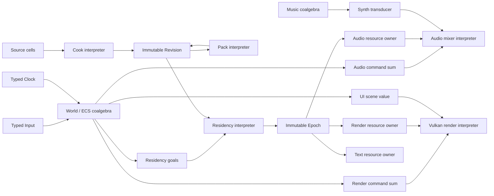

# Whole-engine API factorization TODO

## Status and scope

This document is the complete mathematical factorization requested for the
engine before another behavior-changing refactor begins. It records the current
semantic shape, derives an ideal interface for every engine module, names the
header disposition, and enumerates the implementation work needed to make the
code observationally equivalent to that ideal.

This is not permission to build a runtime category framework. Category theory
is used here to remove accidental states and factor module boundaries. C++26
reflection, `constexpr`, `consteval`, expansion, and splicing compile the result
to plain records, dense arrays, tagged values, direct calls, and owner-specific
effects.

No item is complete merely because this file describes it. Existing visible
output, audio behavior, pack bytes where intentionally retained, hot reload,
thread ownership, publication timing, and benchmark behavior remain the
observational boundary for any later code pass.

## Notation

| Notation | Meaning in the engine |
|---|---|
| `0` | Impossible state or compile-time rejection |
| `1` | Unit; a successful response with no payload |
| `A × B` | Product; both values exist together |
| `A + B` | Coproduct; exactly one alternative exists |
| `A? = 1 + A` | Optional value |
| `Result(A,E) = A + E` | Successful value or domain-local failure |
| `List(A)` | Finite sequence, represented by a bounded span or owned storage |
| `Ref(T)` | Stable identity indexed by semantic type `T` |
| `State_S(A)` | Transition `S -> A × S` before adding an owner effect |
| `IO(A)`, `GPU(A)`, `Audio(A)` | Explicit effect domains, not C++ wrapper classes |
| `F ∘ G` | Composition: apply `G`, then `F` |
| `F ⊗ G` | Independently available interfaces or jointly interpreted values |
| `Σ` | Dependent sum: a tag paired with the payload belonging to that tag |
| `Π` | Dependent product: all required fields, with field-dependent types |

For an API `A`, fully valued requests form `Q_A` and the response to request `q`
has type `R_A(q)`. The interface is the container or polynomial

```text
P_A(X) = Σ(q : Q_A) X ^ R_A(q)
```

An adaptor `A -> B` maps requests forward and responses backward:

```text
request : Q_A -> Q_B
response_q : R_B(request(q)) -> R_A(q)
```

The source module is an interpreter

```text
handle_A : S_A × Q_A -> Effect_A(Σ(r : R_A(q)) S_A)
```

Products, sums, state indices, and effects are therefore separate questions.
A directory split is not automatically a mathematical factor, and a single
implementation owner may interpret several independently includable protocol
sums.

## Global factorization criteria

- Replace tag-plus-fat-record encodings with actual semantic sums. Reflection
  may lower a sum back to a fixed ABI record when transport requires it.
- Replace status-plus-output-pointer encodings with one typed result. A C ABI
  lowering may still use caller storage, but it is generated from the result
  type and cannot represent contradictory states.
- Replace comments that describe temporal legality with build/seal,
  prepare/publish, and live/retired state indices where misuse is expressible.
- Keep pure functions pure and reusable. Move I/O, allocation, device work, and
  publication into the one module that owns the effect.
- Derive bulk operations by lifting scalar semantics through `List` unless
  layout or atomicity makes bulk a genuinely different operation.
- Generate structural operations from reflected declarations. Do not use
  reflection merely to validate a hand-maintained second description.
- Keep stable identities separate from storage addresses, content identities,
  epochs, and owner slots.
- Make the engine entry point a composition root, not a privileged caller of
  private backend state.

## Whole-engine composition target



The arrows are typed values or explicit owner adaptors. They are not service
lookups, foreign pointers, generic callbacks, file paths standing in for
assets, or runtime reflection nodes.

## Module derivations

### 1. Structural reflection and compile-time values

Current carrier:

```text
Meta_now
  = CheckedArithmetic
  × EnumDomain
  × EnumNames
  × EnumContracts
  × FieldMaskContracts
  × PointerPayloadContracts
  × TaggedUnionContracts
  × Option
  × EnumValue
  × EnumFlags
```

`anoptic_meta.h` contains a sound reflected enum core, but it also contains
helpers shaped around the current render/audio fat command records. The latter
use reflection to prove a manual encoding rather than deriving the encoding
from the semantic sum.

For any reflected record or union, define its structural shape recursively:

```text
Shape(record T) = Π(m : members(T)) Shape(type(m))
Shape(enum E)   = Σ(e : enumerators(E)) 1
Shape(A[N])     = Fin(N) -> Shape(A)
Shape(pointer)  = explicit boundary policy, never silently structural data
```

The ideal meta module exposes reflection stabilization, checked arithmetic,
structural concepts, enum proofs, and generic folds over `Shape(T)`. Audio,
render, resource, and GPU policy annotations remain in those modules.

TODO:

- [ ] Fold `anoptic_meta_types.h` into `anoptic_meta.h` or make it a genuinely
  independent lower dependency; do not retain the current include-only split.
- [ ] Replace `reflect_field_uses`, pointer-payload policy, and command-specific
  tagged-union proof helpers with generic sum/product derivation primitives.
- [ ] Keep one checked-arithmetic authority shared by memory, resources, glTF,
  UI, and pack parsing.
- [ ] Require stabilized reflection ranges before expansion and retain only
  final generated products.

### 2. Domain outcomes

Current fallible APIs use several non-isomorphic encodings:

```text
A -> bool
A -> int
A × Ptr(B) -> E
A × Ptr(B) × Capacity -> E × Count
A -> Nullable(B)
ANO_RESULT_TYPE(D) ~= record { code : E_D }
```

These permit response states that the semantics do not: failure with a live
output, success with a null required output, or an empty value that might mean
allocation failure.

The factorization is

```text
status-only : A -> Result(1, E_D)
value       : A -> Result(B, E_D)
bounded     : A × Capacity -> Result(Bounded(B), E_D)
```

The ideal `anoptic_results.h` is a C-compatible lowering of reflected,
domain-local `Result(B,E_D)` sums. Domain errors stay with their module. C++
callers see the typed value; C ABI callers may supply storage through generated
adapters with exactly the same response algebra.

TODO:

- [ ] Inventory every public `bool`, `int`, nullable return, and out-parameter
  combination and name its actual success and error alternatives.
- [ ] Make empty strings, zero handles, and empty spans valid values rather than
  implicit allocation/error channels.
- [ ] Generate error-name functions from reflected error sums.
- [ ] Preserve hot-path trivial layout and `[[nodiscard]]` behavior.

### 3. Collections and standard containers

Current algebra:

```text
anoptic_collections = 0
anoptic_hive        = identity alias(std::hive or plf::hive)
```

An empty header and an implementation-selection alias do not define engine
semantics. The ideal form is no module. Modules use the whitelisted C++26
standard container directly. A custom container is introduced only when a
measured ownership/layout law differs from the standard type.

TODO:

- [ ] Delete `anoptic_collections.h`.
- [ ] Delete `anoptic_hive.h` once every supported toolchain supplies the pinned
  `std::hive` implementation.
- [ ] Keep container allocation policy explicit through the memory substrate.

### 4. Linear algebra and ABI values

Current carrier:

```text
Math_now = R^2 × Packed(R^3) × Std430(R^4) × ColumnMajor(R^(4×4))
```

The types are useful plain data, but coordinate space, scalar, packing, and ABI
role live mainly in names and comments. Generic `Vector3` and `Vector4` can be
used in semantically incompatible places while preserving layout.

The ideal family is indexed by the facts that affect composition:

```text
Vec(Scalar, Dimension, Space, Layout)
Mat(Scalar, Rows, Columns, FromSpace, ToSpace, Layout)

compose : Mat(B,C) × Mat(A,B) -> Mat(A,C)
```

Reflection derives std430 and vertex-stream ABI descriptions from the exact
types. It does not generate numerical linear-algebra algorithms through
template metaprogramming.

TODO:

- [ ] Name packed vertex data separately from aligned shader-block vectors.
- [ ] Encode coordinate-space distinctions where they prevent real misuse.
- [ ] Replace mirrored GPU offset assertions with reflected ABI compilation.
- [ ] Keep the plain-data, no-runtime dependency and direct upload properties.

### 5. Memory ownership and contiguous layout

Current protocol:

```text
Memory_now
  = Region(create, allocate, reset, destroy)
  × Volume(create, retain, release, write, seal, view)
  × LayoutCursor(reserve)
  × ReflectedPlan
  × IndependentArrayGrowth
  × MimallocAllocator
```

The implementation already proves the important performance model: reflected
ordered segment planning, one contiguous volume, disjoint construction spans,
one seal, owner-level retention, and wholesale mimalloc-region destruction.
The remaining accidental states are pointer/null results and one `MemoryVolume`
type callable in both construction and sealed states.

Segment plans form the free ordered monoid under sequence concatenation:

```text
(P1 ++ P2) ++ P3 = P1 ++ (P2 ++ P3)
[] ++ P = P = P ++ []
```

Each segment induces a checked partial state transition on the layout cursor.
Function composition of those transitions is associative; the resulting
offsets still depend on declaration order and alignment, so the measured
`{size, alignment}` summaries are not claimed to form a commutative or naïvely
associative scalar operation. Reflection interprets a product declaration by
folding its ordered segment plan over the cursor.

The ideal state transition is

```text
plan    : Counts(P) -> Result(Layout(P), Overflow)
create  : Region × Layout(P) -> Result(BuildingVolume(P), AllocError)
write_i : BuildingVolume(P) × Reservation_i -> MutSpan(T_i)
seal    : BuildingVolume(P) -> SealedVolume(P)
view_i  : SealedVolume(P) × Reservation_i -> Span(const T_i)
retain  : SealedVolume(P) -> SealedVolume(P)
release : final owner -> wink out region
```

Scratch regions have a distinct resettable capability. Published volume spans
cannot be rewritten. Reference counting remains once per owner volume, never
once per artifact span.

TODO:

- [ ] Express construction and sealed states as different C++ capabilities.
- [ ] Hide retain/release behind one trivial owner value where this does not
  obscure cross-C-boundary lifetime.
- [ ] Deduplicate `checked_*`, `ano_size_*`, array growth, and region array
  growth around one checked layout arithmetic core.
- [ ] Keep region reset restricted to scratch owners after quiescence.
- [ ] Preserve the proven resource-manager volume policy and benchmark it after
  any type-level change.

### 6. Concurrency and typed transport

Current algebra:

```text
Concurrency_now
  = CompilerAtomic(T, MemoryOrder)
  × PublicPthreadSurface
  × SpscRing(T)
  × ByteSpscRing(stride)
  × LatestValue(T)
  × module-private worker pools
```

`anoptic_threads.h` exposes `pthread_*` representations, so the alleged
platform abstraction is not a type abstraction. `SpscRing<T>` and `SeqPub<T>`
are closer to the ideal: their transported type is explicit and their
single-producer/single-consumer law is structural.

For each transport value `T`:

```text
Channel_N(T) = Producer(T,N) × Consumer(T,N)
send : Producer × T -> Result(Producer, Full)
recv : Consumer -> Empty + (T × Consumer)

Latest(T) = Publisher(T) × Observer(T)
publish : Publisher × T -> Publisher
acquire : Observer -> Empty + (T × Observer)
```

The endpoints are dual capabilities and preserve order. `map(f)` over a channel
is valid for pure representation-preserving `f`; it does not add another worker
or callback layer. A resource worker group remains private until a second owner
demonstrates the same scheduling algebra.

TODO:

- [ ] Replace public pthread aliases with platform-neutral opaque/value
  capabilities while keeping OS adaptation in `src/threads/`.
- [ ] Keep `anoptic_atomic.h` as the no-C++-runtime compiler-builtin boundary.
- [ ] Keep typed fixed-stride transport generic; move `ByteSpscRing` to the
  owner that actually needs runtime stride unless a second use proves it common.
- [ ] Derive command transport storage from semantic command sums.
- [ ] Do not introduce futures, general work stealing, or a universal executor
  absent a demonstrated protocol.

### 7. Time and clocks

Current API exposes several projections of time as unrelated integers:

```text
Time_now
  = now_raw_ns : 1 -> u64
  × ticks : 1 -> u64
  × ticks_to_ns : u64 -> u64
  × now_us : 1 -> u64
  × now_ms : 1 -> u32
  × unix : 1 -> i64
  × localtime : i64 -> DateTime
  × busywait_ns
  × sleep_us
```

The factorization separates values, clocks, conversions, and scheduling
effects:

```text
Instant(Clock) - Instant(Clock) -> Duration
Instant(Clock) + Duration -> Instant(Clock)
convert : Duration(U) -> Duration(V)
now : Clock -> Effect(Instant(Clock))
wait : Duration -> SchedulerEffect(Result(1, WaitError))
```

Monotonic, raw-counter, Unix, and civil clocks are different objects. Unit
conversion is pure. Busy waiting is a scheduler policy, not another clock.

TODO:

- [ ] Introduce typed instants and durations without adding runtime wrappers.
- [ ] Make truncating conversions explicit.
- [ ] Separate civil-time failure from the all-zero valid-looking value.
- [ ] Keep resource deadlines and benchmark timestamps on a monotonic clock.

### 8. Filesystem, paths, and source I/O

Current algebra mixes four concerns:

```text
Filesystem_now
  = EnvironmentPaths
  × SessionStamp
  × ProcessCwdMutation
  × AppendOnlyFile
```

It does not expose the immutable read/snapshot abstraction required by the
resource manager, so resource importers use lower-level file operations of
their own.

The factorization is

```text
Environment : 1 -> GamePath × UserPath × LogPath
Source       = PathSource + MemorySource + PackRangeSource
read         : Source -> IO(Result(ImmutableSnapshot, FileError))
AppendSink   : Path -> IO(Result(Sink, FileError))
append       : Sink × Bytes -> IO(Result(1, FileError))
sync         : Sink -> IO(Result(1, FileError))
```

Session naming belongs to diagnostics policy. Process working-directory
mutation belongs to bootstrap and is not a general filesystem operation.
Resource cells name sources through stable source identities; a path is one
possible source-provider value, not asset identity.

TODO:

- [ ] Add immutable source snapshot and metadata-stability operations.
- [ ] Route cooker acquisition through this public I/O algebra.
- [ ] Move session-stamp policy to diagnostics and CWD mutation to engine
  bootstrap or remove it through absolute paths.
- [ ] Use typed outcomes instead of fixed-path zero length and integer status.

### 9. Strings, UTF, and interning

Current `anostr_t` has a valuable 16-byte immutable representation, but its
semantic sum is partially erased:

```text
String_now = Inline(Bytes<=12) + Long(Ptr × Length × ExternalLifetimeFact)
```

For a long value, owned and borrowed storage have the same type. Allocation
failure often returns the same empty value as a legitimate empty string.

The ideal algebra separates lifetime while preserving the compact value:

```text
StringView = Span(const byte)
String     = Inline + RegionOwned
Utf8       = Validated(StringView)
Builder    : EmptyBuilder -> BuildingString -> String

(String, concat, empty) is a monoid
slice, compare, hash : pure morphisms
Intern : InternState × StringView -> Symbol × InternState
```

UTF is an interpretation over bytes, not a second storage type. Collation is an
ordering interpretation. Invalid UTF behavior remains total where specified,
while validation produces a distinct refined value.

TODO:

- [ ] Distinguish borrowed views from owned strings in signatures.
- [ ] Return allocation failure separately from the empty string.
- [ ] Preserve 16-byte immutable storage and prefix fast paths.
- [ ] Make builder consumption a typestate transition.
- [ ] Keep `anoptic_strings_utf.h` as the focused extension.

### 10. Diagnostics and crash blackbox

Current logger is a global state machine with variadic formatting and mutable
route configuration. The crash blackbox correctly has a distinct restricted
execution domain but shares session-path policy through the filesystem module.

The record algebra is

```text
Record = Severity × Route × SourceLocation? × Message
Log = List(Record)

emit : Record -> LogEffect(1)
drain : List(Record) -> SinkEffect(1)
drain(xs ++ ys) = drain(xs) ++ drain(ys)
```

The asynchronous logger is an interpreter from the free monoid of records to
terminal/file sinks. The crash blackbox is a separate interpreter

```text
CrashRecord -> AsyncSignalSafeIO(NoReturn)
```

and shares only immutable session identity and a stable record format.

TODO:

- [ ] Give initialization, configuration, emission, flush, and teardown typed
  outcomes.
- [ ] Preserve producer nonblocking behavior and crash-handler restrictions.
- [ ] Remove `log_old.h` and `log_old.c` after proving no build consumes them.
- [ ] Keep crash-stack ownership automatically composed with engine thread
  creation.

### 11. Reflected glTF and GLB source schema

Current `anogltf.h` already proves the central technique: reflected schema
records, typed indices, annotations, expansion, spliced field access, generic
parse/validation, and direct accessors. Its semantic parse operation is still
surrounded by allocation and filesystem callback tables, one mutable
`AnoGltfData` state containing several ownership modes, and distinct bind/load
procedures whose sequencing is mostly documentary.

The source algebra is

```text
RawGltf = JsonGltf(Bytes) + Glb(Bytes)
ParsedGltf = reflected foreign-schema product
BufferInputs = Π(i : externalBuffers) SourceRef(Buffer_i)

parse : RawGltf -> Result(ParsedGltf, GltfError)
bind  : ParsedGltf × BufferInputs -> Result(BoundGltf, GltfError)
project : BoundGltf -> engine resource cells
```

JSON glTF and binary GLB are alternative producers, not flags in an otherwise
identical file object. External buffers and images are explicit products with
their source provenance. Resource import supplies allocation and I/O effects;
the schema parser does not own a generic callback plugin model.

TODO:

- [ ] Preserve and extend the existing reflection-derived schema compiler.
- [ ] Separate parsed and fully bound typestates.
- [ ] Represent `.gltf` and `.glb` source cells explicitly in the resource
  category.
- [ ] Replace importer-side hand projection that duplicates reflected field
  relationships with generated structural projection.
- [ ] Keep numerical accessor conversion as ordinary `constexpr` or runtime
  functions selected by reflected source types.

### 12. Mesh conditioning

Current mesh code is a private set of clean-room numerical procedures for
vertex-cache ordering, meshlets, bounds, and LOD simplification. It has no
public engine header and is called as implementation detail.

Its algebra is already naturally functional:

```text
optimize_cache : Mesh -> Mesh
meshlets       : Mesh -> List(Meshlet)
bounds         : Meshlet -> Bounds
simplify_qem   : Mesh × ErrorBudget -> LODMesh
lod_chain      : Mesh × List(ErrorBudget) -> List(LODMesh)
```

The ideal form keeps the numerical kernels private and declares the meaningful
input/output cell morphisms in `anoptic_render_resources.h`. Reflection derives
field access, layout, validation, and route integration; ordinary algorithms
perform the numerical work and are `constexpr` wherever their operations allow.

TODO:

- [ ] Declare canonical mesh-conditioning transforms in the resource language.
- [ ] Remove call-site conversion records that reflection can project directly.
- [ ] Keep `src/mesh/ano_meshoptimizer.h` private unless a non-resource public
  consumer demonstrates a separate API.
- [ ] Preserve mesh output and renderer performance with golden and fuzz tests.

### 13. Reflected resource language, cooking, revisions, packs, and residency

Current resource algebra is split by implementation history:

```text
Resources_now
  = RuntimeTypeRegistry
  × ArtifactCodec
  × ImportCallbackDispatch
  × CookerState
  × PackOwnedRevisionType
  × ResidencyState
  × RenderSpecificReloadPublication
```

The strongest implemented pieces are retained: reflected canonical artifact
operations, content and schema identities, persistent cooker state, immutable
source snapshots, action-key reuse, bounded parallel work, contiguous sealed
artifact volumes, structurally shared revisions, authenticated packs, demand
closure, immutable epochs, generation coalescing, and owner-safe render
publication. The factorization removes the descriptions and paths that remain
parallel to those facts.

Let `C_R` be the free category generated by reflected cell types and transform
functions. A transform with inputs `X_1 ... X_n` and output `Y` is the primitive
morphism

```text
f : X_1 × ... × X_n -> Y
```

For each output type:

```text
Provenance(Y)
  = Σ(f : Producer(Y)) Π(i : Inputs(f)) Ref(InputType(f,i))
```

The generated focus operations in epoch `E` are

```text
down_E : Focus_E(Y) -> Provenance_E(Y)
up_E   : Focus_E(X; ContextToY) -> Focus_E(Y)
resolve_E : Ref(T) -> Missing + View_E(T)
```

`ContextToY` is the derivative, or one-hole context, of the selected producer
product. It makes focused `up()` singular without a parent pointer or reverse
transform. Global consumers remain a separate relation.

The central runtime object factor is

```text
SourceGraph --Cook_p--> Revision
Revision    --Pack-----> PackBytes
PackBytes   --Open-----> Revision
Revision × Demand --Residency--> Epoch
Epoch × Edit(T) --COW--> CandidateEpoch --Publish--> Epoch
```

`Revision` is both the codomain of cook/open and the domain of pack/residency.
It therefore owns its own public boundary. Cook, pack, and runtime are sibling
interpreters and do not include each other merely to name it.

The ideal resource compile-time interpretations are:

```text
Schema : C_R -> StructuralSchemas
Wire   : C_R -> CanonicalBytes
Route  : C_R -> DirectMaterializationPlans
Demand : ReflectedComponents -> ResidencyGoals
```

The runtime interpretations are dense packed images of those products. No
generic reflection graph, `void *` transform node, or virtual asset object
survives.

TODO — compile-time language:

- [ ] Extend `compile_resource_language` from local declaration validation to
  complete artifact/transform/importer closure.
- [ ] Discover the universe once from visible reflected declarations; remove
  parallel artifact, importer, owner, and route inventories.
- [ ] Generate producer sums, input products, focused derivatives, direct
  `up()`/`down()`, reachability, invalidation masks, capability frontiers, and
  executor bridge requirements.
- [ ] Reject cycles, duplicate identities, illegal owner edges, unsupported
  wire shapes, ambiguous required routes, and incomplete retained profiles at
  the responsible declaration.
- [ ] Keep the C generic schema/validate/dependency functions only as generated
  foreign-boundary adapters; typed production code calls direct operations.

TODO — public factorization:

- [ ] Add `anoptic_resources_revision.h` and move opaque revision ownership,
  identity, typed lookup, provenance, dependency, and navigation views into it.
- [ ] Make `anoptic_resources_cook.h`, `anoptic_resources_pack.h`, and
  `anoptic_resources_runtime.h` depend on revision rather than on one another.
- [ ] Remove `AnoResourceEncodeFunction` and `void *context` as semantic cook
  declarations; generate direct encoding jobs from reflected artifact types.
- [ ] Replace manifest `uint64_t producer` with the generated closed provenance
  tag and typed input product encoding.
- [ ] Make source, parsed, canonical, runtime-loadable, and owner-resident cells
  uniformly addressable by `AssetRef<T>`.

TODO — cooker and pack:

- [ ] Preserve the long-lived instance DAG, current action keys, dirty
  consequence closure, persistent executor, cancellation, and content-equality
  cutoffs.
- [ ] Make reflected transform edges, not importer-specific bookkeeping, the
  source of dependency and invalidation structure.
- [ ] Keep changed artifacts in disjoint final volume reservations and retain
  unchanged owners once per volume.
- [ ] Treat pack export/open as deterministic interpretations of revision;
  opened packs and live cooks expose identical revision queries.
- [ ] Add historical CAS lookup only after the current-result fast path is
  measured and only if it improves real authoring workflows.

TODO — residency and editing:

- [ ] Generate typed goal, resolve, and navigation functions over dense columns.
- [ ] Replace render-specific reload ownership with a generic candidate
  transaction plus owner-specific prepare/safe-point/retire interpreters.
- [ ] Guarantee that an edit changes only its reflected upward consequence cone
  and that equal outputs stop propagation.
- [ ] Publish one coherent epoch per commit-group floor; leave the last complete
  epoch visible on every failure.
- [ ] Retain only revision metadata and distinct artifact volumes reachable from
  demand, plus owner slots awaiting safe retirement.

### 14. Render resource category and realization

Current `anoptic_render_resources.h` contains an excellent reflected artifact
nucleus for texture, material, mesh, scene, and opaque GPU cells. It also
includes cooker, runtime, and memory headers; declares a glTF importer that
mutates a cooker; and exposes a renderer-specific reload publication protocol.

The cell subcategory is

```text
RawImage + Ktx2 + ... -> PixelImage -> Texture -> GpuTexture
RawGltf + Glb -> BoundGltf -> Scene
Scene -> List(Mesh × Material × Transform) × List(Light)
Mesh -> ConditionedMesh -> GpuMesh
Material × List(TextureRef) -> GpuMaterial
Scene × resident products -> GpuScene
```

The ideal owner interpretation is a partial functor over render-owned cells:

```text
Realize_render : PortableRenderCell -> GPU(OpaqueSlot)
Retire_render  : OpaqueSlot × FenceSerial -> GPU(1)
```

It preserves stable resource identity while changing representation. Vulkan
objects and allocation policy are not resource cells exposed outside the
renderer; opaque slots are.

TODO:

- [ ] Restrict `anoptic_render_resources.h` to cell declarations, annotations,
  and typed transform signatures.
- [ ] Express glTF projection as reflected source-to-render transforms rather
  than a cooker-mutating importer function.
- [ ] Move prepare/poll/cancel publication to the renderer/runtime owner
  composition, generated from the generic transaction protocol.
- [ ] Add shader source, include closure, SPIR-V module, pipeline family,
  KTX2/Basis, mip atom, meshlet, and LOD cells as concrete features require.
- [ ] Preserve renderer staging, frame-in-flight safe swap, slot quarantine,
  and fence retirement.

### 15. Render protocol and logic/render transport

Current public algebra is a tensor of unrelated responsibilities:

```text
Render_now
  = VulkanNamedLifecycle
  × WindowClose
  × CaptureToFilesystemPath
  × ResourceSceneProjection
  × FontBakeLookup
  × RenderCommandTransport
  × TextTransport
  × UiTransport
  × InputEvents
  × ViewPublication
  × RuntimeTuningGlobals
```

The current command representation is approximately

```text
RenderCommand_now = Kind × Π(all command fields) × Ptr(optional owned payloads)
```

Reflection validates which subsets may be observed and constructs bulk packing
plans. That is valuable, but it compensates for a non-algebraic semantic type.

The actual command sum is

```text
RenderCommand
  = Create(CreatePayload)
  + Update(RenderId × UpdateDelta)
  + Destroy(RenderId)
  + StreamTransforms(StreamSlice)
  + LightAttach(LightAttachPayload)
  + LightUpdate(LightId × LightDelta)
  + LightDetach(LightId)
  + Text(TextCommand)
  + Ui(UiCommand)

UpdateDelta = Σ(nonempty reflected subsets) Product(selected fields)
```

The transport ABI is generated from that sum. Bulk update is
`List(Update(RenderId,Delta))` with a specialized SoA lowering because the
layout has measured value; its semantics are not a second hand-maintained
protocol.

The ideal public render factor is

```text
Render = FrameLifecycle ⊗ RenderWorldProtocol ⊗ ViewProtocol
RenderText and RenderUi are focused extension sums
```

TODO:

- [ ] Replace `initVulkan`, `unInitVulkan`, `drawFrame`, and global bridge access
  with backend-neutral render owner/session operations.
- [ ] Declare actual command/event sums and generate the fixed ring encoding,
  ownership table, field validation, visitation, copy, and destruction.
- [ ] Keep the reflected SoA bulk plan, deriving it from scalar update products.
- [ ] Move resource scene projection and fallback/default assets to typed
  resource resolution.
- [ ] Move font bake lookup to text resources.
- [ ] Split text and UI submission into `anoptic_render_text.h` and
  `anoptic_render_ui.h` so base render does not import both type systems.
- [ ] Replace capture-to-path with a captured-frame value or sink request; file
  I/O composes outside render.
- [ ] Replace independent tuning globals with a typed render-policy snapshot or
  delta sum.

### 16. Input and display events

Current input records are a reflected tag/union inside `anoptic_render.h` and
are emitted by GLFW callbacks owned by the Vulkan backend. The event union is
already close to the semantic sum, but input consumers must depend on the whole
renderer and backend lifecycle.

The ideal type is

```text
InputEvent
  = Key(KeyEvent)
  + Button(ButtonEvent)
  + Cursor(CursorEvent)
  + Scroll(ScrollEvent)
  + Focus(FocusEvent)
  + Resize(ResizeEvent)
  + Character(CodepointEvent)
  + Close
```

The platform/window adapter is a morphism from GLFW/OS events into this sum.
The world consumes input independently of how frames are rendered. Display
extent and focus are latest-value state; discrete inputs are ordered events.

TODO:

- [ ] Extract `anoptic_input.h` with the closed reflected sum.
- [ ] Generate the transport union and visitation from the event declarations.
- [ ] Keep GLFW callbacks private to the window-owning backend.
- [ ] Ensure render and headless/tool worlds can choose different input
  interpreters without changing world code.

### 17. Vulkan backend

Current `src/vulkan_backend/` is a large private owner with reflected GPU ABI,
attachment graph, pass contracts, mesh rows, descriptor schemas, slot pools,
geometry, shadows, UI/text raster paths, staging, windowing, and bridge
consumption. Its leakage is that `engine/main.c` includes private render API,
Vulkan, and GLFW headers.

The ideal backend is one private interpreter:

```text
VulkanInterpreter :
  RenderSessionState
  × ResidencyEpoch
  × List(RenderCommand)
  × ViewState
  -> GPU(RenderSessionState × PresentedFrame × List(RenderEvent))
```

Resource realization is a related owner interpreter over render cells and
returns opaque slots. The reflected pass/attachment/ABI declarations remain
compile-time structural authorities. Frame code sees dense plans and direct
calls, not a generic graph.

TODO:

- [ ] Remove every private Vulkan/GLFW include from `engine/main.c`.
- [ ] Make `render_bridge` a private transport interpretation of the public
  render sum, not a separately visible semantic module.
- [ ] Continue replacing mirrored descriptor/pass/layout tables with reflected
  compilation where it reduces both code and invalid states.
- [ ] Keep GPU allocation, geometry holes, descriptor lifetime, and fence
  quarantine as renderer-specific policies over the shared memory mechanism.
- [ ] Preserve frame output and performance through rendered goldens, capture
  output, and full benchmark sweeps.

### 18. Text, fonts, and shaping

Current algebra combines global FreeType ownership with immutable bake values
and pure shaping:

```text
Text_now = GlobalFaceRegistry(Path -> FontId) × Bake(FontId,Ranges) × Shape
```

The pure part is

```text
shape   : FontBake × Utf8 × StyleRuns -> List(GlyphInstance) × Pen
measure : FontBake × Utf8 × StyleRuns -> Extent
```

The effectful resource path is

```text
FontSource -> TextFace -> FontBake -> GlyphAtlas/GpuTextData
```

Font bytes must outlive every face that borrows them. That lifetime is a
resource-owner fact, not a path lookup hidden behind global `AnoFontId`.

TODO:

- [ ] Keep `anoptic_text.h` for immutable bake types and pure shape/measure.
- [ ] Add `anoptic_text_resources.h` for font source, face, bake, atlas, and
  owner transforms.
- [ ] Move path-based load and global FreeType lifecycle behind the text
  resource owner.
- [ ] Derive glyph/range/point ABI validation and text-to-render projection from
  reflected declarations.
- [ ] Preserve the current in-world font output and lifetime regression tests.

### 19. UI scene algebra

Current UI is already close to an algebraic design: a bounded builder folds
primitive constructors into packed primitive, clip, paint, stop, curve, and
glyph tables; CPU reference and tiled evaluators interpret the same scene.
Its primitive kind is still paired with a universal record containing fields
for all primitive alternatives, and a demo generator is public API.

The semantic type is

```text
UiPrimitive
  = RoundedRect(RRect)
  + Shadow(Shadow)
  + Image(Image)
  + Path(Path)
  + GlyphRun(GlyphRun)

UiScene = List(UiPrimitive) × ClipTable × PaintTable × CurveTable
build : List(UiCommand) -> Result(PackedUiScene, CapacityError)
eval_cpu, eval_gpu : PackedUiScene -> Image
```

The two evaluators are observationally equivalent interpretations subject to
the documented raster tolerance.

TODO:

- [ ] Declare the actual primitive sum and generate the packed GPU ABI record.
- [ ] Make reference indices typed by table domain.
- [ ] Replace sentinel/capacity overflow returns with typed outcomes.
- [ ] Move `ano_ui_demo_scene` to examples/tests.
- [ ] Preserve CPU/GPU reference equivalence and tiled rendering tests.

### 20. Audio mixer, devices, and audio resources

Current audio algebra combines mixer configuration, device selection, one fat
command record, event transport, sample-buffer ownership, listener publication,
telemetry, an arbitrary generator callback family, music-control tunneling,
offline rendering, and path-based WAV import/export.

The current command encoding is

```text
AudioCommand_now
  = Kind
  × SourcePayload
  × BusPayload
  × FxPayload
  × BufferPointer
  × MusicPayload
```

with reflection proving which fields and pointer ownership are legal. The
semantic command is instead

```text
AudioCommand
  = Play(SourceId × SourceDesc)
  + Update(SourceId × SourceDelta)
  + Stop(SourceId)
  + SetBus(BusId × BusDelta)
  + SetEffect(BusId × EffectSlot × EffectParam)
  + AdoptBuffer(AudioBufferSlot × AudioBlock)
  + RetireBuffer(AudioBufferSlot)

AudioEvent
  = SourceRetired(SourceId)
  + BufferRetired(AudioBufferSlot)
  + Capacity(AudioCapacity)
  + Underrun(UnderrunInfo)
```

The mixer is a coalgebra at block boundaries:

```text
mix : MixerState × List(AudioCommand) × Listener × BlockTime
   -> Audio(MixerState × StereoBlock × List(AudioEvent) × Telemetry)
```

Native devices and offline rendering are alternate interpreters of this same
transition. Music is not an audio command alternative. Synth composition
produces bus samples and desk automation as typed values at the engine root.

Audio resources form their own RCRG branch:

```text
Sound
  -> ResidentSample + Stream
ResidentSample <- Wav + OggOpus + other decoded source formats
Stream         <- OggOpusPages + Mp3Frames + other seekable streams
ResidentSample -> MixerBufferSlot
Stream         -> MixerStreamSlot
```

Format matters only below the branch where decoding/streaming policy needs it.
Every intermediate cell remains directly addressable.

TODO:

- [ ] Replace command fat record with a reflected sum and generated ring ABI.
- [ ] Remove ACMD music alternatives and generator control/poll/stats callback
  lattice from the audio semantic API.
- [ ] Add `anoptic_audio_resources.h` with WAV and Ogg Opus source routes,
  decoded blocks, seek inventory, stream state, and mixer slots.
- [ ] Move WAV path load/write to resource/codec and explicit sink effects.
- [ ] Preserve allocation-free, mutex-free, decode-free mixer callbacks and
  block-boundary adoption/retirement.
- [ ] Keep native and offline mixer output bit-equivalent where currently
  promised.

### 21. Music composition

Current music code is already a deterministic state machine, but its public
surface exposes a large configuration product, imperative control functions,
string-selected override parameters, and raw snapshot buffers.

Its irreducible coalgebra is

```text
MusicControl
  = SetAffect(Affect)
  + RequestKey(KeyRequest)
  + RequestMotif(MotifId)
  + SetOverride(MusicParameter)
  + ClearOverride(MusicParameterId)

step : MusicState × List(MusicControl)
    -> MusicState × MusicBar
```

Configuration is an initial state parameter. Snapshot and restore are a
canonical isomorphism over the persistent state subset:

```text
decode(snapshot(state)) = state
```

TODO:

- [ ] Declare one reflected `MusicControl` sum and typed parameter values.
- [ ] Replace string parameter dispatch and patch-name mirrors with reflected
  identifiers and generated names.
- [ ] Expose deterministic step as the core interface; convenience controls
  lower to it.
- [ ] Make snapshots canonical save/resource cells with schema fingerprints.
- [ ] Preserve the Python oracle and deterministic generation outputs.

### 22. Synthesis

Current synth owns voices and score scheduling but also attaches an
`AnoMusicEngine`, implements audio generator callbacks, forwards audio commands
to music, emits audio commands for console automation, and maintains separate
batch/live loading surfaces.

The ideal transducer is

```text
SynthInput = ScoreEvent + MusicBar + TransportEvent

render : SynthState × List(SynthInput) × FrameRange
      -> SynthState
       × BusSamples
       × List(MixerAutomation)
       × List(SynthEvent)
```

Batch score and live music are two producers of the same ordered input stream.
Audio consumes `BusSamples` and `MixerAutomation`. Music produces `MusicBar`.
The engine root composes them; synth owns neither neighbor.

TODO:

- [ ] Remove `AnoMusicEngine *` attachment from the ideal synth interface.
- [ ] Remove audio callback signatures and `ano_music_apply_command` from
  `anoptic_synth.h`.
- [ ] Unify batch/live ingestion behind one ordered synth input algebra while
  retaining bounded live storage.
- [ ] Keep the render hook allocation-free, lock-free, and deterministic.
- [ ] Preserve score timing, console automation, voice behavior, and offline
  output.

### 23. World, ECS, levels, and saves

There is no current ECS module. Mutable demo-world state, resource requests,
camera/input handling, renderable spawning, lights, UI, and music control live
procedurally in `engine/main.c`. Resource design already requires native world
cells and coherent ECS/resource publication, so absence is a zero interface,
not evidence that the concern belongs in main.

The ideal world coalgebra is

```text
WorldInput = InputEvent + TimeStep + GameEvent + ResourceChanged

step_world : WorldState × List(WorldInput)
          -> WorldState
           × DemandDelta
           × RenderDelta
           × AudioControl
           × UiScene
```

Persistent components form reflected column products. A world cell is an
immutable resource value:

```text
WorldCell
  = ArchetypeSchemas
  × ComponentColumns
  × LocalEntityRefs
  × List(Ref(ResourceCell))
  × SpatialBounds
  × CommitGroupFloor
```

Publication pairs the mutable ECS snapshot with the immutable resource epoch:

```text
FrameWorld = EcsEpoch × ResidencyEpoch
```

Saves are not memory dumps:

```text
save : WorldState -> SaveCell(PersistentComponentProjection × ManifestRoot)
load : SaveCell × Revision -> Result(WorldState, SaveError)
```

Transient slots, pointers, epochs, playback cursors not declared persistent,
and GPU handles are excluded by reflection.

TODO:

- [ ] Add `anoptic_ecs.h` for archetype/column state and `anoptic_resources_ecs.h`
  for reflected resource references and world cells.
- [ ] Move demo world, camera, spawn, light, UI, and music state out of main.
- [ ] Generate demand deltas from reflected `AssetRef<T>` fields on component
  insertion/removal/change rather than scanning every frame.
- [ ] Implement coordinated `FrameWorld` publication.
- [ ] Define reflected persistent-field policy and canonical save cells.

### 24. Engine process composition

Current `engine/main.c` is a super-module. It includes public APIs, a private
Vulkan backend header, Vulkan and GLFW directly, resource cooking/reload worker
policy, scene spawning, input, camera, UI, audio, music, synth, and teardown.

The ideal engine root has no independent domain algebra. It chooses concrete
interpreters and composes them:

```text
Engine
  = compose(
      PlatformClock,
      PlatformFilesystem,
      InputInterpreter,
      WorldInterpreter,
      ResourceInterpreter,
      RenderInterpreter,
      AudioInterpreter,
      TextInterpreter,
      UiInterpreter,
      MusicInterpreter,
      SynthInterpreter)
```

Its only state is ownership of module sessions and their lawful initialization
and teardown order. Game-specific Sponza/Viking/candle/font content is a client
manifest and world value, not engine bootstrap semantics.

TODO:

- [ ] Remove private Vulkan/GLFW/backend includes and calls from main.
- [ ] Move resource cooker/reload policy into resource/tool clients and expose
  only public transaction values to the root.
- [ ] Move demo world behavior into a game/world module.
- [ ] Make startup and teardown a typed product of acquired module sessions,
  released in reverse dependency order.
- [ ] Keep the full current scene, font, lighting, candles, Viking Room, hot
  reload, audio optionality, and captures as black-box acceptance behavior.

## Exact current header inventory

The consolidated table below groups large private families for readability.
Those groups expand to this exact inventory; no current engine header is omitted
from the survey.

Public headers:

```text
include/anogltf.h
include/anoptic_atomic.h
include/anoptic_audio.h
include/anoptic_collections.h
include/anoptic_filesystem.h
include/anoptic_hive.h
include/anoptic_log_crash.h
include/anoptic_log.h
include/anoptic_math.h
include/anoptic_memory_typed.h
include/anoptic_memory.h
include/anoptic_meta_types.h
include/anoptic_meta.h
include/anoptic_music.h
include/anoptic_render_resources.h
include/anoptic_render.h
include/anoptic_resources_cook.h
include/anoptic_resources_pack.h
include/anoptic_resources_runtime.h
include/anoptic_resources_typed.h
include/anoptic_resources.h
include/anoptic_results.h
include/anoptic_strings_utf.h
include/anoptic_strings.h
include/anoptic_synth.h
include/anoptic_text.h
include/anoptic_threads_typed.h
include/anoptic_threads.h
include/anoptic_time.h
include/anoptic_ui.h
```

Private headers:

```text
src/audio/audio_bridge.h
src/audio/audio_command_contract.h
src/audio/audio_format.h
src/audio/audio_fx.h
src/audio/audio_internal.h
src/audio/audio_pull.h
src/audio/audio_source.h
src/audio/dsp/biquad.h
src/audio/dsp/delay.h
src/audio/dsp/dynamics.h
src/audio/dsp/env.h
src/audio/dsp/grain.h
src/audio/dsp/noise.h
src/audio/dsp/osc.h
src/audio/dsp/smooth.h
src/audio/dsp/svf.h
src/audio/dsp/wavetable.h
src/filesystem/filesystem_internal.h
src/log/log_core.h
src/log/log_crash_internal.h
src/log/log_crash_posix.h
src/log/log_old.h
src/log/log_ring.h
src/mesh/ano_meshoptimizer.h
src/music/music_arp.h
src/music/music_bass.h
src/music/music_cadence.h
src/music/music_conductor.h
src/music/music_control.h
src/music/music_counter.h
src/music/music_det.h
src/music/music_dramaturg.h
src/music/music_form.h
src/music/music_gen.h
src/music/music_imitation.h
src/music/music_ir.h
src/music/music_melody.h
src/music/music_modes.h
src/music/music_modifiers.h
src/music/music_motif.h
src/music/music_pad.h
src/music/music_perc.h
src/music/music_signatures.h
src/music/music_theory.h
src/music/music_verify.h
src/music/music_vocab.h
src/render_bridge/bulk_update_plan.h
src/render_bridge/render_bridge.h
src/render_bridge/render_command_contract.h
src/resources/cooker_internal.h
src/resources/parallel.h
src/strings/ano_collate_tables.h
src/strings/ano_strings_internal.h
src/strings/ano_unicode_tables.h
src/synth/synth_internal.h
src/text/text_internal.h
src/threads/threads_macos.h
src/ui/ui_path.h
src/vulkan_backend/backend.h
src/vulkan_backend/bridge/bridge.h
src/vulkan_backend/buffer_types.h
src/vulkan_backend/components.h
src/vulkan_backend/frame/frame.h
src/vulkan_backend/frame/pass_schema.h
src/vulkan_backend/frame/schema/attachment_graph.h
src/vulkan_backend/frame/schema/compute_barriers.h
src/vulkan_backend/frame/schema/cull_ubo.h
src/vulkan_backend/frame/schema/draw_profiles.h
src/vulkan_backend/frame/schema/mesh_rows.h
src/vulkan_backend/frame/schema/pass_contract.h
src/vulkan_backend/geometry.h
src/vulkan_backend/gpu_alloc.h
src/vulkan_backend/instance/descriptor_layout_schema.h
src/vulkan_backend/instance/instanceInit.h
src/vulkan_backend/instance/pipeline.h
src/vulkan_backend/instance/pipelines/additive.h
src/vulkan_backend/instance/pipelines/flat.h
src/vulkan_backend/instance/pipelines/transmission.h
src/vulkan_backend/light_registry.h
src/vulkan_backend/light_types.h
src/vulkan_backend/material_schema.h
src/vulkan_backend/pipeline_registry.h
src/vulkan_backend/render_api.h
src/vulkan_backend/render_slots.h
src/vulkan_backend/resources/resources.h
src/vulkan_backend/scene_buffers.h
src/vulkan_backend/shadow/shadow_types.h
src/vulkan_backend/shadow/shadow.h
src/vulkan_backend/slot_upload.h
src/vulkan_backend/structs.h
src/vulkan_backend/text_raster.h
src/vulkan_backend/texture/texture.h
src/vulkan_backend/ui_raster.h
src/vulkan_backend/vertex/vertex.h
src/vulkan_backend/vulkanConfig.h
src/vulkan_backend/vulkanMaster.h
```

## Consolidated factorization table

Each result occupies two adjacent rows. The first row is the current
mathematical representation. The bold row immediately below it is the final
factored representation.

| Module name (abstract, ideal platonic interface) | Current `.h` files | Algebra |
|---|---|---|
| Structural compiler — current helper product | `include/anoptic_meta.h`; `include/anoptic_meta_types.h`; domain contract helpers in `src/render_bridge/render_command_contract.h` and `src/audio/audio_command_contract.h` | `Checked × Enum × FieldMask × PointerPolicy × TaggedUnionProof × ValueWrappers` |
| **Structural compiler — final reflected shape interpreter** | **Current files above; target one `include/anoptic_meta.h`, with domain policy returned to owners** | **`Shape(record)=Π fields`; `Shape(enum)=Σ cases`; generic compile-time folds derive direct code** |
| Outcomes — current status conventions | `include/anoptic_results.h`; scalar status conventions across every public header | `bool + int + Nullable(T) + (E × OutPtr(T))` as unrelated encodings |
| **Outcomes — final domain result family** | **Current `include/anoptic_results.h`; target reflected C-compatible result lowering** | **`Result(T,E_D)=T+E_D`; one response type per fallible request** |
| Collections — current empty/alias layer | `include/anoptic_collections.h`; `include/anoptic_hive.h` | `0 × Identity(std::hive)` |
| **Collections — final no engine module** | **Delete both current headers after the pinned C++26 library supplies `std::hive`** | **`0`; use standard containers directly unless a new measured law exists** |
| Linear algebra — current layout records | `include/anoptic_math.h`; mirrored private GPU schema headers | `R² × Packed(R³) × Std430(R⁴) × ColumnMajor(R⁴ˣ⁴)` |
| **Linear algebra — final indexed value family** | **Current `include/anoptic_math.h`; GPU mirrors become reflected products** | **`Vec(Scalar,N,Space,Layout)` and `Mat(From,To,Layout)` with typed composition** |
| Memory — current callable state product | `include/anoptic_memory.h`; `include/anoptic_memory_typed.h` | `Region × LayoutCursor × MutableVolume × SealedFlag × RefCount × ArrayGrowth` |
| **Memory — final lifetime/layout algebra** | **Retain both current headers with construction/sealed capabilities** | **Free ordered segment-plan monoid plus checked cursor fold; `BuildingVolume(P) -> SealedVolume(P)`; one owner count; region wink-out** |
| Concurrency — current OS surface and transports | `include/anoptic_atomic.h`; `include/anoptic_threads.h`; `include/anoptic_threads_typed.h`; `src/threads/threads_macos.h` | `CompilerAtomic × PublicPthread × SPSC(T) × ByteSPSC × Latest(T)` |
| **Concurrency — final typed capability algebra** | **Retain public names; hide pthread representation and move owner-specific byte rings** | **Dual `Producer(T,N) × Consumer(T,N)`, latest publication, and private platform interpreters** |
| Time — current unit-bearing scalars | `include/anoptic_time.h` | Product of unrelated `u64/u32/i64` clock queries plus wait functions |
| **Time — final clock-indexed values** | **Current `include/anoptic_time.h` with strong zero-cost types** | **`Instant(C)`, `Duration(U)`, pure conversion, `now_C`, and scheduler `wait` effect** |
| Filesystem — current environment/append product | `include/anoptic_filesystem.h`; `src/filesystem/filesystem_internal.h` | `EnvironmentPaths × SessionStamp × CwdMutation × AppendFile` |
| **Filesystem — final path/source/sink algebra** | **Current header; session/CWD policy moves to diagnostics/bootstrap** | **`Source=Path+Memory+PackRange`; immutable `read`; typed append/sync sink effects** |
| Strings — current lifetime-erased compact sum | `include/anoptic_strings.h`; `include/anoptic_strings_utf.h`; `src/strings/ano_strings_internal.h` | `Inline(Bytes≤12) + Long(Ptr×Length×erased lifetime)`; empty also signals failure |
| **Strings — final immutable sequence algebra** | **Retain base/UTF headers; make view/owner and failure explicit** | **`StringView`; `String=Inline+RegionOwned`; UTF refinement; string monoid; owner-thread intern state** |
| Diagnostics — current global logger pair | `include/anoptic_log.h`; `include/anoptic_log_crash.h`; `src/log/log_core.h`; `log_ring.h`; crash headers; `log_old.h` | Global logger state plus separate crash hooks and filesystem-owned session policy |
| **Diagnostics — final record interpreters** | **Retain public pair; delete old logger; diagnostics owns session policy** | **Free monoid `List(Record)` folded to sinks; separate `CrashRecord -> AsyncSignalSafeIO(NoReturn)`** |
| glTF — current schema plus callback-owned parser state | `include/anogltf.h`; implementation selected by `src/resources/import/anogltf.c` | Reflected foreign product plus allocator/file callbacks and mutable parse/bind/load phases |
| **glTF — final reflected source algebra** | **Retain `anogltf.h`; effects supplied by resource importer** | **`RawGltf=Json+GLB`; `parse`; explicit buffer-input product; `BoundGltf`; reflected projection** |
| Mesh — current private numerical library | `src/mesh/ano_meshoptimizer.h` | Independent procedures over caller-shaped arrays |
| **Mesh — final private pure transform family** | **Keep current header private; public morphisms declared in `anoptic_render_resources.h`** | **`Mesh -> OptimizedMesh -> Meshlets/LOD`; reflection derives structure, ordinary code computes** |
| Resource manager — current layered subsystem | `include/anoptic_resources.h`; `anoptic_resources_typed.h`; `anoptic_resources_cook.h`; `anoptic_resources_pack.h`; `anoptic_resources_runtime.h`; `src/resources/cooker_internal.h`; `parallel.h` | `Registry × Codec × CallbackImporter × Cooker × PackOwnedRevision × Residency × RenderReload` |
| **Resource manager — final reflected residency category** | **Current family plus new `anoptic_resources_revision.h` and `anoptic_resources_ecs.h`; sibling cook/pack/runtime dependencies** | **Free typed category `C_R`; generated provenance sums/products; `Cook/Open -> Revision`; `Pack(Revision)`; `Residency(Revision,Demand)->Epoch`; COW publication** |
| Render resources — current reflected nucleus plus orchestration | `include/anoptic_render_resources.h`; `src/vulkan_backend/resources/resources.h` | `Texture+Material+Mesh+Scene+Gpu*` cells combined with cooker importer and render-only reload object |
| **Render resources — final owner subcategory** | **Retain current public name for declarations only; runtime publication composes elsewhere** | **Portable render cell category interpreted by `Realize_render` into opaque fence-retired slots** |
| Render protocol — current super-interface | `include/anoptic_render.h`; `src/render_bridge/render_bridge.h`; `render_command_contract.h`; `bulk_update_plan.h` | `Lifecycle × ResourceLookup × FatCommand × Text × UI × Input × CaptureIO × View × Globals` |
| **Render protocol — final command/event algebra** | **Retain `anoptic_render.h`; add `anoptic_render_text.h` and `anoptic_render_ui.h`; input leaves** | **Actual command/event sums; frame/world/view tensor; reflected fixed-ring and SoA bulk lowerings** |
| Input/display — current render-owned event family | Input/event declarations in `include/anoptic_render.h`; window state in private Vulkan headers | `RenderDependency × TagUnion(Input) × WindowGlobals` |
| **Input/display — final independent event protocol** | **Extract current declarations to new `include/anoptic_input.h`; GLFW adapter remains private** | **`InputEvent=Key+Button+Cursor+Scroll+Focus+Resize+Character+Close`; latest display state** |
| Vulkan backend — current private owner with public leakage | `src/vulkan_backend/*.h`; `bridge/*.h`; `frame/**/*.h`; `instance/**/*.h`; `resources/*.h`; `shadow/*.h`; `texture/*.h`; `vertex/*.h` | Procedural GPU owner plus reflected subgraphs, directly included by engine main |
| **Vulkan backend — final private render interpreter** | **Same private header family; no file becomes public and main includes none** | **`State × Epoch × List(RenderCommand) × View -> GPU(State × Frame × Events)`** |
| Text — current global face state plus pure shaping | `include/anoptic_text.h`; `src/text/text_internal.h` | `Global(Path->FontId) × Bake(FontId,Ranges) × Shape(FontBake,Text)` |
| **Text — final resource owner plus pure morphisms** | **Retain `anoptic_text.h`; add `anoptic_text_resources.h`** | **`FontSource -> Face -> FontBake -> Atlas`; pure `shape/measure`; source lifetime retained by owner** |
| UI — current packed tagged record and interpreters | `include/anoptic_ui.h`; `src/ui/ui_path.h` | Builder over `Kind × UniversalPrimitiveRecord`; CPU reference and GPU consumer |
| **UI — final free scene algebra** | **Retain `anoptic_ui.h`; demo leaves public API** | **`UiPrimitive=RRect+Shadow+Image+Path+GlyphRun`; fold to packed scene; CPU/GPU interpreters** |
| Audio — current mixer/device/callback super-interface | `include/anoptic_audio.h`; `src/audio/audio_bridge.h`; `audio_command_contract.h`; `audio_format.h`; `audio_fx.h`; `audio_internal.h`; `audio_pull.h`; `audio_source.h`; `dsp/*.h` | `Device × FatCommand × Event × BufferOwner × GeneratorCallbacks × MusicTunnel × Offline × WavPathIO` |
| **Audio — final mixer coalgebra and resource extension** | **Retain `anoptic_audio.h`; add `anoptic_audio_resources.h`; path/music concerns leave** | **Actual command/event sums; block-state transition; native/offline interpreters; audio source/stream cell graph** |
| Music — current imperative deterministic engine | `include/anoptic_music.h`; `src/music/music_*.h` | `Config × MutableState × separate control functions × StringOverride × RawSnapshot` |
| **Music — final typed Mealy machine** | **Retain `anoptic_music.h`; private vocabulary remains owned by music** | **`step : State × List(MusicControl) -> State × MusicBar`; canonical reflected snapshot isomorphism** |
| Synth — current transducer plus neighbor ownership | `include/anoptic_synth.h`; `src/synth/synth_internal.h` | `ScoreScheduler × Voices × AudioCallbacks × MusicPointer × BatchAPI × LiveAPI` |
| **Synth — final score/bar-to-samples transducer** | **Retain `anoptic_synth.h`; audio/music adapters move to engine composition** | **`State × Inputs × FrameRange -> State × BusSamples × Automation × Events`** |
| World/ECS/persistence — current absent module | No public header; state and behavior in `src/engine/main.c`; resource types partly in render headers | `0` as module, with ad hoc mutable products in main |
| **World/ECS/persistence — final state and resource algebra** | **Add `anoptic_ecs.h` and `anoptic_resources_ecs.h`** | **World coalgebra; reflected archetype columns; `FrameWorld=EcsEpoch×ResidencyEpoch`; canonical save projection** |
| Engine root — current super-module | No public header; `main.c` includes public headers plus private `vulkan_backend/render_api.h`, Vulkan, and GLFW | Central product of module internals, demo behavior, cooker/reload worker, and backend calls |
| **Engine root — final composition only** | **No public header required; main includes only public protocol headers** | **Associative composition of selected interpreters; owns sessions and ordering, no domain behavior** |

## Dependency-ordered implementation work

This is a dependency graph, not a sequence of arbitrary checkpoints. A later
edge may be implemented in the same pass when its prerequisite laws and
black-box behavior remain demonstrable.

```text
semantic sums/results/typestates
          |
          +--> reflected structural derivation
          |          |
          |          +--> render/audio transport lowering
          |          +--> resource provenance/navigation
          |          `--> ECS demand/save projection
          |
shared Revision boundary
          |
          +--> cook/open equivalence
          +--> pack serialization
          `--> residency/edit transactions
                         |
                         +--> render owner publication
                         +--> audio owner publication
                         `--> text owner publication

input + time + world/ECS
          |
          +--> render/audio/UI demand and deltas
          `--> engine composition root cleanup
```

The first implementation pass selected from this document must state which
connected subgraph it changes and which public observations prove equivalence.
It must not opportunistically rename every header or rewrite every module at
once.

## Required observational evidence for later code changes

| Boundary changed | Required evidence |
|---|---|
| Reflected structural compiler | Compile-time rejection fixtures plus direct generated operation tests |
| Memory typestate/layout | Existing memory surface tests, overflow fuzzing, resource bake benchmarks, no extra artifact allocations |
| Resource revision factor | Live-cook/opened-pack query equivalence, pack authentication fuzzing, identical visible scene |
| Resource navigation | Typed raw/parsed/canonical/runtime/owner focus tests and focused `up(down(x)) = x` laws |
| Cooker/import projection | Sponza, Viking Room, candles, lights, materials, font and shader semantic counts/content |
| Residency/edit publication | Repeated material/model/font swaps, previous epoch readability, no mixed generation, supersession stress |
| Render command sum | Command/event fuzzing, bulk/scalar semantic equivalence, rendered goldens and full FPS sweep |
| Input extraction | Identical ordered input stream and latest display state under the GLFW adapter |
| Text factor | In-world font golden, shaping/measurement API tests, borrowed font-byte lifetime stress |
| UI factor | CPU reference/golden and GPU output equivalence, capacity/fuzz boundaries |
| Audio command/resource factor | Mixer API/fuzz tests, native/offline equivalence, real-time no-allocation checks, buffer retirement stress |
| Music/synth separation | Python oracle, snapshot round trip, batch/live equivalence, offline audio golden |
| ECS/world extraction | Same initial camera/world, all visible assets and lights, coherent `FrameWorld` publication |
| Engine root cleanup | Full release build, automated frame capture without desktop capture, full tests and benchmark sweep |

The intended result is less code and fewer representable states. If a proposed
factor adds a registry, wrapper hierarchy, runtime polymorphism, duplicated
schema, or adapter that cannot be erased to direct code, it has failed this
design even if its mathematical vocabulary sounds sophisticated.
